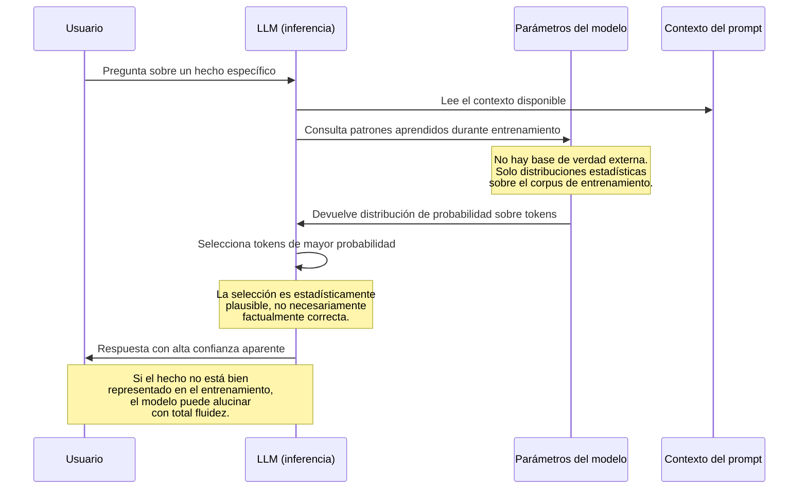

# Ingeniería de IA desde los Fundamentos

# Módulo I — Los Fundamentos de la Inteligencia Artificial

# Capítulo 12 — Mitos sobre la Inteligencia Artificial

**Versión:** 0.5 (Revisión conceptual)

---

## 1. Objetivos de aprendizaje

Al finalizar este capítulo serás capaz de:

1. Identificar los diez mitos más comunes sobre la Inteligencia Artificial (IA) y refutarlos con argumentos técnicos precisos.
2. Explicar por qué los Large Language Models (LLM) producen alucinaciones, cómo detectarlas y qué estrategias de mitigación existen.
3. Diferenciar contexto de conversación de aprendizaje real del modelo.
4. Distinguir correlación de causalidad en el contexto del razonamiento estadístico de los modelos de Machine Learning (ML).
5. Explicar qué son los sesgos (bias) en modelos de IA y por qué emergen del proceso de entrenamiento.
6. Evaluar si una creencia sobre IA tiene sustento técnico o es una simplificación de marketing.
7. Aplicar criterio técnico para tomar decisiones de arquitectura sin dejarse guiar por expectativas incorrectas.

---

## 2. Introducción

Hay una paradoja en la historia reciente de la tecnología: cuanto más poderosa se vuelve una herramienta, más se distorsiona la percepción pública de lo que esa herramienta realmente hace.

Con la IA ocurre exactamente eso. Los sistemas actuales producen texto fluido, código funcional, imágenes fotorrealistas, diagnósticos médicos preliminares y síntesis de documentos complejos. Esa capacidad genera dos reacciones igualmente problemáticas: el entusiasmo sin límites que sobreestima lo que la tecnología puede hacer, y el escepticismo reactivo que la subestima por completo.

Ambas posiciones comparten el mismo defecto: no se apoyan en una comprensión técnica real del sistema.

Este capítulo existe para construir esa comprensión. No para defender ni atacar a la IA, sino para reemplazar afirmaciones vagas con principios técnicos verificables. Quien comprende cómo funciona un sistema puede diseñarlo mejor, usarlo más responsablemente y comunicar sus alcances con precisión.

---

## 3. Motivación: ¿por qué desmitificar antes de construir?

Un arquitecto que parte de premisas falsas construye sobre arena. En el campo de la IA, las premisas falsas tienen consecuencias concretas: proyectos sobredimensionados, sistemas que fallan en producción, decisiones delegadas a modelos que no deberían tomarlas, y presupuestos malgastados en soluciones que un sistema de reglas habría resuelto en una tarde.

Existen tres razones estructurales por las que los mitos sobre IA se propagan con facilidad.

**Primera razón: el gap de abstracción.** La mayoría de las personas interactúan con la IA a través de interfaces que ocultan completamente el mecanismo subyacente. Cuando ChatGPT responde una pregunta de manera fluida, el modelo parece estar razonando. Lo que no se ve es que está prediciendo tokens estadísticamente probables dado el contexto. La interfaz es intuitiva; el mecanismo es contra-intuitivo. Ese gap genera malentendidos casi inevitablemente.

**Segunda razón: el lenguaje de marketing.** Las empresas tienen incentivos para presentar sus modelos de la manera más impresionante posible. Frases como "la IA que realmente entiende tu negocio" o "el modelo que piensa como un experto" son efectivas para ventas y devastadoras para la comprensión técnica. Cuando ese lenguaje se filtra a los equipos técnicos, las decisiones de arquitectura se contaminan.

**tercera razón: la emergencia de capacidades inesperadas.** Los modelos de IA a veces sorprenden con capacidades que sus creadores no anticiparon explícitamente. Eso genera la percepción de que el sistema tiene una inteligencia que "va más allá de sus parámetros". En realidad, esas capacidades emergen de patrones estadísticos en datos de entrenamiento masivos, no de una comprensión genuina. Pero explicar eso requiere más nuance del que permite un tweet o una nota de prensa.

La consecuencia práctica es que los equipos técnicos frecuentemente llegan al diseño de sus primeras soluciones de IA con un mapa mental que no corresponde al territorio real. Desmitificar antes de construir no es un ejercicio académico: es el paso que permite que las decisiones técnicas tengan sustento.

---

## 4. Desarrollo: los 10 mitos

---

### Mito 1 — "La IA piensa como un ser humano"

**El mito**

La interfaz conversacional de los LLM es tan fluida que genera la impresión de que hay un interlocutor que razona, pondera opciones y llega a conclusiones. Esta intuición se refuerza cuando el modelo explica su razonamiento paso a paso, pide aclaraciones o admite incertidumbre.

**La realidad técnica**

Un LLM es un sistema de predicción estadística sobre secuencias de tokens. Durante el entrenamiento, el modelo aprende los patrones de co-ocurrencia de palabras y conceptos presentes en miles de millones de documentos. Durante la inferencia, dado un contexto de entrada, el modelo predice cuál es el token más probable que debería seguir, y luego el siguiente, y así hasta completar la respuesta.

No hay un proceso de razonamiento deliberado. No hay un modelo del mundo que el sistema actualiza en base a nueva evidencia. No hay intención. La fluidez de la respuesta es el resultado de que esos patrones estadísticos, aprendidos sobre corpus masivos de texto producido por humanos que sí razonan, producen salidas que se parecen al razonamiento.

La distinción importa porque tiene consecuencias de diseño. Si un LLM "razonara" como un humano, podría aplicar el sentido común a situaciones completamente nuevas. Pero no lo hace de esa manera: generaliza patrones estadísticos. Eso funciona extraordinariamente bien dentro de la distribución de lo que aprendió, y puede fallar de formas inesperadas fuera de esa distribución.

**Consecuencia de creerlo**

Delegar decisiones al modelo asumiendo que "razonó correctamente" sin validación. Diseñar flujos donde el output del LLM se acepta sin verificación por creer que el sistema "entendió" el problema de la misma forma en que lo haría un experto humano.

**Caso real**

En 2023, dos abogados de Nueva York presentaron un escrito judicial que citaba seis precedentes legales inexistentes, todos generados por ChatGPT. Los abogados asumieron que el modelo había "investigado" la jurisprudencia relevante. El juez Castel impuso sanciones y el caso recibió cobertura internacional. El LLM no había investigado nada: había generado texto con la forma de una cita legal, estadísticamente plausible, pero factualmente inventada.

---

### Mito 2 — "La IA entiende todo lo que le decís"

**El mito**

Si el modelo responde de manera coherente y aparentemente relevante, debe haber "entendido" la pregunta. La comprensión aparente se toma como evidencia de comprensión real.

**La realidad técnica**

La coherencia de la respuesta no es una función de la comprensión semántica profunda: es una función de la similitud con los patrones que el modelo vio durante el entrenamiento. El modelo puede producir una respuesta excelente a una pregunta sobre química cuántica y equivocarse en el mismo párrafo porque confundió dos conceptos con nombres similares en los datos de entrenamiento.

Más importante aún: el modelo no tiene un modelo del interlocutor. No sabe si quien escribe es un experto o un principiante, si la pregunta es trivial o crítica, si la respuesta será usada para un trabajo académico o para una decisión clínica. Opera sobre los tokens del prompt, sin contexto sobre quién los escribió ni para qué.

Esta limitación tiene consecuencias directas en el diseño de prompts. Un prompt ambiguo para un humano experto puede producir respuestas razonables porque el humano infiere el contexto. Un prompt ambiguo para un LLM puede producir respuestas que son coherentes internamente pero que responden a una interpretación distinta a la que tenía el usuario.

**Consecuencia de creerlo**

Diseñar prompts imprecisos asumiendo que el modelo "inferirá el contexto". No invertir en ingeniería de prompts. Asumir que si la respuesta parece correcta, lo es.

**Caso real**

Un sistema de soporte técnico desplegado por una empresa de telecomunicaciones en América Latina usaba un LLM para responder consultas de clientes sobre planes de servicio. Cuando un cliente preguntaba "¿puedo cambiar mi plan sin perder mi número?", el modelo respondía correctamente en la mayoría de los casos. Sin embargo, cuando la pregunta incluía el nombre de un plan específico que había cambiado de denominación comercial, el modelo mezclaba las características del plan antiguo con las del nuevo, produciendo información incorrecta con alto grado de confianza aparente. El equipo técnico había asumido que el LLM "entendería" el catálogo de productos. En realidad, el modelo generalizaba desde sus datos de entrenamiento sin acceso al catálogo actualizado.

---

### Mito 3 — "La IA aprende cada vez que converso con ella"

**El mito**

Dado que el modelo responde teniendo en cuenta el historial de la conversación, muchas personas asumen que esa información queda "grabada" y que el modelo mejora con el uso, incorporando las correcciones y preferencias que el usuario expresa durante la sesión.

**La realidad técnica**

El contexto de conversación y el entrenamiento del modelo son dos procesos completamente distintos.

Durante una sesión, el modelo recibe como entrada todos los mensajes anteriores de la conversación (hasta el límite de su ventana de contexto, o *context window*). Eso le permite mantener coherencia dentro de esa sesión. Si el usuario corrige al modelo, el modelo puede usar esa corrección para los tokens siguientes dentro de la misma sesión. Pero cuando la sesión termina, esa información desaparece. Los parámetros del modelo no cambiaron.

El entrenamiento de un LLM es un proceso completamente diferente: requiere un corpus masivo de datos, semanas o meses de cómputo en hardware especializado, equipos de ingeniería y ML, y procesos de evaluación y ajuste. No ocurre en tiempo real. No ocurre por conversación.

Existen mecanismos como el fine-tuning (ajuste fino) que permiten actualizar un modelo con nuevos datos, pero es un proceso controlado, costoso y separado de la inferencia cotidiana.

**Consecuencia de creerlo**

Asumir que el modelo "aprenderá" las preferencias del usuario con el uso sin ninguna intervención técnica. Diseñar sistemas sin mecanismos de persistencia de contexto (bases de datos, sistemas RAG) porque "el modelo ya sabe". Confundir personalización por contexto inyectado con aprendizaje real del modelo.

**Caso real**

Un equipo de producto de una startup de recursos humanos construyó un asistente de entrevistas que usaba un LLM para sugerir preguntas al entrevistador. Asumieron que el modelo "aprendería" el perfil del candidato a lo largo de múltiples sesiones. En producción, cada nueva sesión comenzaba sin ningún conocimiento de sesiones anteriores. El modelo no había aprendido nada: simplemente no tenía acceso a esa información. El equipo debió construir un sistema de persistencia que inyectaba el historial relevante en el prompt de cada nueva sesión, un trabajo que habría sido planeado desde el inicio si la premisa sobre el aprendizaje del modelo hubiera sido correcta.

---

### Mito 4 — "Cuanto más grande el modelo, mejor"

**El mito**

El número de parámetros de un modelo se usa frecuentemente como proxy de calidad. Un modelo con 70.000 millones de parámetros debe ser mejor que uno con 7.000 millones. La conclusión lógica es que siempre conviene elegir el modelo más grande disponible.

**La realidad técnica**

El tamaño del modelo es uno de varios factores que determinan el desempeño en una tarea específica. Los otros factores incluyen: calidad y composición de los datos de entrenamiento, arquitectura del modelo, proceso de ajuste fino (fine-tuning), técnicas de alineamiento (RLHF, DPO), diseño del prompt, herramientas disponibles al modelo y características del problema a resolver.

Un modelo pequeño ajustado finamente sobre datos de alta calidad para un dominio específico frecuentemente supera en ese dominio a un modelo genérico mucho más grande. Los modelos más grandes también tienen costos operativos mayores, latencias más altas y requieren más infraestructura.

La métrica relevante no es el tamaño: es el desempeño en la tarea específica medido con los criterios correctos para ese problema.

**Consecuencia de creerlo**

Incurrir en costos innecesarios usando modelos grandes para tareas que modelos pequeños resolverían con igual o mejor desempeño. Ignorar el ajuste fino como palanca de mejora más eficiente que escalar el modelo. Comparar modelos por parámetros en lugar de por desempeño medido en las tareas del caso de uso real.

**Caso real**

En 2023, Meta publicó los modelos Llama 2 en distintos tamaños (7B, 13B, 70B parámetros). Investigadores independientes demostraron que el modelo de 13B ajustado finamente con datos curados de alta calidad superaba consistentemente al modelo de 70B sin ajuste fino en tareas de razonamiento médico y legal. El modelo más pequeño y especializado ganó al modelo más grande y genérico. La lección fue explícitamente documentada en la literatura de ML como evidencia de que el ajuste fino sobre datos de dominio es una palanca más eficiente que el escalado puro.

---

### Mito 5 — "La IA reemplazará todo el software"

**El mito**

La IA puede hacer casi cualquier cosa: generar texto, código, imágenes, tomar decisiones. Por lo tanto, en el futuro cercano, el software tradicional será reemplazado por sistemas de IA que manejen todo de forma autónoma e inteligente.

**La realidad técnica**

La IA amplía las capacidades del software. No lo reemplaza.

Los sistemas empresariales reales requieren componentes que los LLM no pueden ni deben reemplazar: bases de datos transaccionales con garantías ACID, APIs con contratos bien definidos, lógica de negocio codificada explícitamente porque su comportamiento debe ser determinista y auditable, sistemas de autenticación y autorización, interfaces de usuario con accesibilidad garantizada, pipelines de datos, sistemas de monitoreo, orquestación de servicios.

En la práctica, los sistemas de IA bien diseñados son componentes dentro de arquitecturas más amplias, no reemplazos de esas arquitecturas. Un asistente corporativo de IA usa un LLM para interpretar consultas en lenguaje natural y generar respuestas, pero detrás tiene bases de datos, APIs de integración, sistemas de logging, controles de acceso y pipelines de validación, todos elementos de ingeniería de software clásica.

**Consecuencia de creerlo**

Proponer arquitecturas donde el LLM reemplaza componentes que deben ser deterministas. Abandonar prácticas de ingeniería de software clásica (testing, versionado, logging, manejo de errores) en sistemas que incluyen IA. Subestimar la complejidad de integración.

**Caso real**

Una empresa de seguros intentó reemplazar su sistema de gestión de pólizas con un agente de IA que respondía consultas directamente desde documentos. El agente funcionaba bien en demostraciones. En producción, las respuestas no eran reproducibles: la misma consulta producía respuestas ligeramente diferentes en distintas ejecuciones porque el LLM tiene un componente estocástico en su generación. Los auditores rechazaron el sistema porque no podían garantizar que el mismo cliente recibiera la misma información en dos consultas consecutivas. La empresa debió rediseñar la solución con el LLM como asistente de búsqueda sobre documentos estructurados, manteniendo la lógica de cálculo de primas y condiciones en sistemas deterministas tradicionales.

---

### Mito 6 — "Siempre conviene usar IA"

**El mito**

La IA es una herramienta poderosa y moderna. En un entorno competitivo, siempre es mejor tener IA que no tenerla. Si no la usamos, nos quedamos atrás.

**La realidad técnica**

La decisión de usar IA debe justificarse técnica y económicamente para cada caso de uso específico.

La IA introduce costos: monetarios (tokens de API, infraestructura de cómputo), de latencia (los modelos son más lentos que una consulta SQL), de complejidad operativa (monitoreo de modelos, gestión de prompts, evaluaciones), de incertidumbre (los modelos no son deterministas) y de mantenimiento (los modelos se degradan cuando los datos cambian, el fenómeno de deriva del dato o *data drift*).

Si una regla condicional resuelve el problema de forma confiable, reproducible y auditable, esa regla es la mejor solución. No porque la IA sea mala, sino porque agrega complejidad sin agregar valor en ese caso específico.

El criterio correcto es siempre: ¿qué solución resuelve este problema al menor costo y con la mayor confiabilidad para los requisitos específicos de este contexto?

**Consecuencia de creerlo**

Aplicar LLM a problemas que se resuelven mejor con búsqueda en base de datos, lógica de negocio o algoritmos deterministas. Incurrir en costos operativos innecesarios. Introducir incertidumbre donde se necesita determinismo.

**Caso real**

Una empresa de comercio electrónico intentó usar un LLM para categorizar automáticamente productos ingresados por vendedores. El LLM tenía un costo de $0.002 por categorización y una tasa de error del 4%. Un clasificador tradicional de ML entrenado con las categorías históricas de la plataforma lograba una tasa de error del 1.8% con un costo de $0.00003 por clasificación. El LLM era 67 veces más costoso y tres veces menos preciso para esa tarea específica. La decisión correcta era obvia una vez que se midieron ambas alternativas. El problema fue que el equipo nunca midió porque asumió que el LLM sería superior por ser "más moderno".

---

### Mito 7 — "La IA siempre dice la verdad"

**El mito**

Si el modelo responde con confianza y detalle, la información debe ser correcta. La fluidez y el nivel de detalle se toman como indicadores de exactitud.

**La realidad técnica**

Este es uno de los mitos más peligrosos en aplicaciones profesionales.

Los LLM pueden producir información incorrecta con la misma seguridad aparente con la que producen información correcta. Este fenómeno se denomina **alucinación**.

#### ¿Por qué ocurren las alucinaciones?

Un LLM genera tokens que son estadísticamente probables dado el contexto. Eso no equivale a generar tokens que sean factualmente correctos. El modelo no tiene acceso a una base de verdad externa durante la inferencia: opera exclusivamente sobre los patrones estadísticos aprendidos durante el entrenamiento.

Cuando se le pregunta algo que no está bien representado en sus datos de entrenamiento, el modelo no responde "no sé": responde con la secuencia de tokens que es más probable dado el contexto, que puede ser una respuesta plausible pero incorrecta. El modelo no tiene un mecanismo interno para distinguir entre lo que sabe y lo que está inventando.

Hay cuatro situaciones donde las alucinaciones son más frecuentes:

1. **Datos de entrenamiento insuficientes:** temas poco representados en el corpus generan mayor incertidumbre estadística, que se traduce en mayor probabilidad de alucinación.
2. **Preguntas sobre hechos específicos:** nombres propios, fechas, cifras, referencias bibliográficas. El modelo puede recordar que existe un documento y generar un título plausible sin que ese documento exista realmente.
3. **Preguntas en el límite del conocimiento de corte:** el modelo no tiene información posterior a su fecha de corte de entrenamiento, pero puede generar respuestas que suenan actuales.
4. **Preguntas que contienen premisas incorrectas:** si el prompt asume algo falso, el modelo frecuentemente continúa la narrativa sin corregir la premisa.

#### ¿Cómo detectar alucinaciones?

Detectar alucinaciones en tiempo real es un problema abierto de investigación. Sin embargo, existen señales prácticas que aumentan la sospecha:

- **Especificidad excesiva:** fechas muy precisas, nombres de personas poco conocidas, estadísticas con decimales, referencias a documentos específicos que no se pueden verificar fácilmente.
- **Inconsistencia interna:** el modelo contradice en un párrafo lo que dijo en otro.
- **Respuestas en dominios de nicho:** cuanto más específico es el dominio, menor la representación en el corpus de entrenamiento y mayor el riesgo.
- **Confianza sin fuentes:** el modelo afirma algo con certeza pero no puede citar la fuente porque esta no existe.

#### Estrategias de mitigación

Las aplicaciones profesionales no confían ciegamente en los outputs de los LLM. Las estrategias más consolidadas incluyen:

- **Retrieval-Augmented Generation (RAG):** en lugar de depender del conocimiento paramétrico del modelo, se le proporcionan documentos relevantes en el contexto. El modelo genera la respuesta basándose en esa información verificable, reduciendo la dependencia de lo que "aprendió" durante el entrenamiento.
- **Citación obligatoria:** diseñar prompts que requieran que el modelo cite la sección específica del documento del que extrae la información. Si no puede citar, la respuesta se marca para revisión humana.
- **Validación humana en el loop:** para decisiones de alto impacto, el output del LLM es un insumo para un revisor humano, no una decisión final.
- **Evaluación automática:** usar un segundo LLM o un sistema de verificación para evaluar la factualidad de las respuestas antes de presentarlas al usuario.
- **Temperatura baja y muestreo determinista:** reducir la temperatura de generación no elimina las alucinaciones, pero reduce la variabilidad y hace más reproducibles los outputs.

**Consecuencia de creerlo**

Presentar outputs de LLM como información verificada sin validación. Tomar decisiones clínicas, legales o financieras basadas en outputs no verificados. No implementar mecanismos de citación ni verificación.

**Caso real**

En 2024, Air Canada fue condenada por un tribunal de Vancouver a compensar a un pasajero porque su chatbot basado en IA había generado información incorrecta sobre la política de tarifas de duelo, prometiendo un reembolso que la aerolínea no otorgaba. Air Canada argumentó que el chatbot era una entidad separada y que el pasajero debía haber verificado la información en la web oficial. El tribunal rechazó el argumento: la empresa era responsable por la información que su sistema automatizado comunicaba a sus clientes. El costo de no validar los outputs del LLM resultó en daño reputacional, litigio y compensación económica.

---

### Mito 8 — "La IA es objetiva"

**El mito**

A diferencia de los humanos, que tienen prejuicios, la IA toma decisiones basadas en datos. Por lo tanto, es más justa y objetiva que cualquier proceso de decisión humano.

**La realidad técnica**

La IA aprende de datos producidos por humanos. Si esos datos contienen sesgos (bias), el modelo los aprenderá, los amplificará y los aplicará a escala.

El sesgo en los sistemas de IA no es un defecto de implementación: es una consecuencia estructural del proceso de entrenamiento. Los datos de entrenamiento son una fotografía del mundo tal como existe, no del mundo tal como debería ser. Si los datos históricos de contratación muestran que ciertos perfiles fueron menos contratados (por razones que incluyen discriminación), el modelo aprenderá a asignarles menor puntuación. No porque discrimine intencionalmente, sino porque maximiza la predicción sobre los datos disponibles.

Los tipos de sesgo más documentados incluyen:

- **Sesgo de representación:** ciertos grupos están subrepresentados en los datos de entrenamiento, lo que produce peor desempeño del modelo para esos grupos.
- **Sesgo histórico:** los datos reflejan decisiones pasadas que contenían discriminación. El modelo aprende esos patrones y los reproduce.
- **Sesgo de medición:** los atributos usados como proxy de la variable que se quiere predecir introducen correlaciones espurias.
- **Sesgo de amplificación:** los modelos pueden amplificar sesgos que están débilmente presentes en los datos porque el proceso de optimización intensifica las señales estadísticas más fuertes.

**Consecuencia de creerlo**

Delegar decisiones que afectan a personas (contratación, crédito, atención médica, justicia penal) a sistemas de IA sin auditoría de sesgos. Asumir que automatizar un proceso humano elimina sus sesgos en lugar de automatizarlos.

**Caso real**

Amazon desarrolló entre 2014 y 2017 un sistema de Machine Learning para filtrar candidatos a empleo. El sistema fue entrenado sobre 10 años de currículums enviados a la empresa y los resultados de contratación correspondientes. Dado que la industria tecnológica había contratado históricamente más hombres que mujeres, el modelo aprendió a penalizar currículums que incluían la palabra "mujeres" (como en "club de mujeres en ciencias") y a devaluar estudios en universidades femeninas. Amazon desactivó el sistema en 2017. El sesgo no fue intencional: fue el resultado directo de entrenar un modelo sobre datos que reflejaban decisiones históricas discriminatorias.

---

### Mito 9 — "La IA puede razonar causalmente"

**El mito**

Si el modelo puede explicar por qué algo ocurrió, o predecir qué pasará si se toma una acción, entonces está razonando sobre causas y efectos, no solo sobre correlaciones.

**La realidad técnica**

Los modelos de ML, incluidos los LLM, operan fundamentalmente sobre correlaciones estadísticas en los datos. Eso es cualitativamente diferente al razonamiento causal.

El razonamiento causal requiere poder responder preguntas del tipo: "¿qué pasaría si interviniéramos activamente en el sistema cambiando la variable X?" Esa pregunta implica un modelo de cómo el mundo funciona, no solo de cómo los datos covarían. Un LLM puede generar texto que suena a razonamiento causal porque los humanos que produjeron el texto de entrenamiento razonaban causalmente. Pero el modelo no tiene un modelo causal del mundo: tiene patrones estadísticos sobre cómo se estructura el texto sobre causalidad.

La distinción práctica: un modelo puede predecir que los hospitales con más helados vendidos tienen más muertes (correlación real en datos históricos de verano), pero no puede "entender" que la variable confundidora es la temperatura. Si no está en los datos de entrenamiento o en el contexto, el modelo puede proponer intervenciones basadas en esa correlación espuria.

**Consecuencia de creerlo**

Usar predicciones de ML para justificar intervenciones causales sin validación experimental. Tomar decisiones de política basadas en correlaciones que el modelo detectó sin analizar si son causales. Diseñar sistemas de recomendación que optimizan métricas correlacionadas con el objetivo real en lugar del objetivo real.

**Caso real**

Un estudio publicado en *Science* en 2019 documentó que un algoritmo de salud ampliamente usado en hospitales de Estados Unidos asignaba puntuaciones de riesgo basadas en el costo histórico de atención médica en lugar de la severidad de las condiciones clínicas. Dado que los pacientes de ciertos grupos socioeconómicos habían tenido históricamente menos acceso a atención médica, su costo histórico era menor. El algoritmo interpretó ese menor costo como indicador de mejor salud y les asignaba menor prioridad para programas de manejo de enfermedades crónicas. La correlación entre costo histórico y riesgo real existía en los datos, pero la causalidad era inversa a la que el sistema implicaba.

---

### Mito 10 — "La IA tiene memoria entre sesiones por defecto"

**El mito**

Si hablo con un asistente de IA hoy y mañana retomo la conversación, el sistema recuerda lo que discutimos. La continuidad percibida en algunas interfaces sugiere que el modelo mantiene un estado persistente.

**La realidad técnica**

Por defecto, los LLM son stateless: cada nueva sesión comienza sin ningún conocimiento de sesiones anteriores. La ilusión de memoria que ofrecen algunas plataformas es el resultado de implementaciones específicas, no de una capacidad inherente del modelo.

Las plataformas que ofrecen "memoria" la implementan de una de estas formas:

1. **Almacenamiento de resúmenes:** el sistema guarda un resumen de conversaciones anteriores y lo inyecta en el contexto de nuevas sesiones.
2. **Bases de datos de perfil:** cierta información sobre el usuario se almacena explícitamente y se recupera para nuevas sesiones.
3. **Recuperación por similitud:** usando embeddings y búsqueda vectorial, el sistema recupera fragmentos relevantes de conversaciones anteriores y los incluye en el prompt.

Todas estas son soluciones de ingeniería externas al modelo. El modelo en sí no recuerda nada entre sesiones: recibe un contexto que contiene información de sesiones anteriores y la procesa como cualquier otro contexto.

Esta distinción es crítica para el diseño de sistemas. Si una aplicación necesita persistencia de contexto entre sesiones, esa persistencia debe diseñarse explícitamente: base de datos, mecanismo de recuperación, estrategia de síntesis del historial.

**Consecuencia de creerlo**

Diseñar aplicaciones que asumen persistencia sin implementarla. Ofrecer a los usuarios una experiencia de continuidad que no existe. No contemplar en el diseño los costos de la persistencia (almacenamiento, recuperación, gestión de contexto relevante).

**Caso real**

Un equipo de desarrollo construyó un asistente de onboarding para nuevos empleados usando un LLM de la API de un proveedor cloud. El asistente debía acompañar al empleado durante sus primeras cuatro semanas, recordando qué temas ya habían sido discutidos. En las pruebas internas todo funcionó: la misma persona usó el asistente de forma continua en una sola sesión larga. En producción, los empleados iniciaban sesiones en distintos momentos del día. El asistente no recordaba nada: cada vez preguntaba el nombre del empleado, en qué área trabajaba y qué temas ya había visto. La experiencia fue percibida como deficiente. El equipo debió implementar un sistema de persistencia que no estaba en el diseño original, retrasando el lanzamiento seis semanas.

---

## 5. Analogía

Imagina que contratas a un consultor extraordinariamente bien preparado que leyó toda la producción académica, periodística y técnica de los últimos veinte años. Habla con fluidez sobre cualquier tema, conecta conceptos de forma brillante y produce presentaciones impecables.

Pero este consultor tiene características particulares: no puede distinguir si un dato que recuerda es real o si es una inferencia plausible que construyó a partir de lecturas previas. No sabe qué ocurrió la semana pasada porque su formación se detuvo en un punto determinado. Cuando termina la reunión, al día siguiente no recuerda nada de lo que discutieron a menos que alguien le proporcione un resumen escrito. Y si le preguntás por qué recomienda algo, puede construir una justificación causal convincente que en realidad es una racionalización de un patrón estadístico, no un análisis causal real.

Ese consultor es extraordinariamente útil para muchas cosas: sintetizar información compleja, redactar documentos, explorar opciones, generar variantes de una propuesta. Pero delegarle decisiones críticas sin verificación, asumir que sus afirmaciones son siempre correctas o creer que recuerda todo lo que le dijiste ayer son errores que llevan a problemas concretos.

Los LLM son herramientas de una capacidad extraordinaria con limitaciones igualmente reales. Comprender ambas dimensiones es lo que permite usarlos bien.

---

## 6. Diagrama Mermaid: brecha entre percepción pública y realidad técnica

```mermaid
graph TB
    subgraph PERCEPCION["Percepción pública común"]
        P1["Piensa como un humano"]
        P2["Entiende todo lo que le decís"]
        P3["Aprende con cada conversación"]
        P4["Más grande = mejor"]
        P5["Reemplaza todo el software"]
        P6["Siempre conviene usarla"]
        P7["Siempre dice la verdad"]
        P8["Es objetiva y sin sesgos"]
        P9["Razona sobre causas"]
        P10["Recuerda entre sesiones"]
    end

    subgraph REALIDAD["Realidad técnica"]
        R1["Predice tokens estadísticamente probables"]
        R2["Generaliza patrones del entrenamiento"]
        R3["El contexto de sesión ≠ aprendizaje del modelo"]
        R4["Tamaño es uno de varios factores de calidad"]
        R5["La IA es un componente dentro de arquitecturas"]
        R6["Cada caso requiere justificación técnica"]
        R7["Puede alucinar con alta confianza aparente"]
        R8["Aprende y amplifica sesgos de los datos"]
        R9["Detecta correlaciones, no causalidad"]
        R10["Stateless por defecto: persistencia requiere ingeniería"]
    end

    P1 -->|"realidad"| R1
    P2 -->|"realidad"| R2
    P3 -->|"realidad"| R3
    P4 -->|"realidad"| R4
    P5 -->|"realidad"| R5
    P6 -->|"realidad"| R6
    P7 -->|"realidad"| R7
    P8 -->|"realidad"| R8
    P9 -->|"realidad"| R9
    P10 -->|"realidad"| R10

    style PERCEPCION fill:#fef9c3,stroke:#ca8a04
    style REALIDAD fill:#dcfce7,stroke:#16a34a
```

---

## 7. Diagrama Mermaid: anatomía de la alucinación

---

## 8. Ejemplo real: organización que tomó una mala decisión por creer en un mito

### Contexto

En 2022, un sistema judicial de un estado de Estados Unidos implementó una herramienta de IA para asistir en la evaluación de riesgo de reincidencia de personas acusadas de delitos. La herramienta fue adoptada porque la administración del tribunal asumía dos cosas: que la IA era más objetiva que los jueces humanos (Mito 8) y que el modelo, al haber sido entrenado sobre datos de décadas de registros criminales, podía predecir causalmente el riesgo de una persona específica (Mito 9).

### El problema

Investigadores de ProPublica analizaron los outputs del sistema y documentaron que asignaba puntuaciones de riesgo significativamente más altas a personas de determinados grupos raciales, incluso controlando por variables como el tipo de delito y la historia criminal previa. El modelo había aprendido patrones de los registros históricos que reflejaban desigualdades estructurales en el sistema de justicia: más arrestos, más procesamientos y más condenas en ciertos grupos, no necesariamente por mayor propensión al delito, sino por diferencias en la aplicación histórica de la ley.

El tribunal asumió que la herramienta era objetiva porque era un sistema de ML. No lo era: era un sistema que automatizaba y escaleaba los sesgos presentes en los datos históricos.

Adicionalmente, el sistema fue usado para justificar decisiones de libertad condicional como si las puntuaciones fueran predicciones causales del comportamiento futuro. En realidad, eran correlaciones estadísticas sobre poblaciones históricas, no predicciones individuales con base causal.

### Las consecuencias

Personas recibieron condenas más severas o fueron rechazadas para libertad condicional en base a un algoritmo que sus defensores no podían examinar, cuestionar ni rebatir. El impacto recayó desproporcionadamente sobre poblaciones ya vulnerables. El caso generó legislación sobre transparencia de algoritmos en decisiones judiciales en varios estados y se convirtió en referencia central en la literatura sobre ética de la IA.

### La lección para arquitectos

Creer que un sistema de ML es objetivo porque "se basa en datos" es confundir el proceso con el resultado. Los datos no son neutrales: son registros de un mundo con sesgos históricos. Un sistema de ML bien diseñado incluye auditorías de sesgo, mecanismos de explicabilidad y, en dominios de alto impacto sobre personas, supervisión humana obligatoria en el loop de decisión.

---

## 9. Conversación con un arquitecto

**Director de Tecnología:** Acabo de leer que nuestra competencia implementó IA generativa para gestión de contratos. Necesitamos implementarlo también, lo antes posible. El modelo que usen debe ser el mejor disponible.

**Arquitecto:** Entiendo la presión competitiva. Antes de hablar del modelo, necesito entender el problema específico. ¿Qué hacen hoy con los contratos que quieren mejorar o automatizar?

**Director:** El proceso de revisión de contratos tarda demasiado. Queremos que la IA los lea y nos diga si hay cláusulas problemáticas.

**Arquitecto:** Eso tiene sentido como caso de uso. Hay algo importante que definir desde el inicio: ¿qué hace el equipo legal con la salida del sistema? ¿La usa como insumo para su propia revisión, o queremos que la IA tome la decisión final sobre si un contrato es aceptable?

**Director:** Idealmente que tome la decisión directamente. Para eso la queremos.

**Arquitecto:** Esa es la parte que necesito que revisemos juntos. Un LLM puede alucinar: producir una análisis que parece correcto pero que omite una cláusula crítica o interpreta incorrectamente una condición. Si el sistema toma la decisión final sin revisión humana en contratos que tienen consecuencias legales y financieras, el riesgo para la organización es alto. El caso de los abogados de Nueva York que presentaron jurisprudencia inventada por ChatGPT es exactamente eso, pero escalado a nivel de sistema.

**Director:** Entonces, ¿para qué sirve la IA en este caso?

**Arquitecto:** Para hacer que el trabajo del equipo legal sea mucho más eficiente. El modelo puede leer el contrato, identificar secciones relevantes, marcar cláusulas que no siguen la plantilla estándar y generar un resumen de puntos de atención. El abogado revisa ese resumen y los pasajes marcados en lugar de leer el contrato completo. El tiempo de revisión puede reducirse significativamente. Pero la decisión final sigue siendo del profesional que puede ser responsable de ella.

**Director:** ¿Y qué modelo usamos? ¿El más potente disponible?

**Arquitecto:** Depende de lo que midamos. El modelo más grande tiene la latencia más alta y el costo por token más alto. Para revisar contratos de cien páginas varias veces al día, eso se vuelve relevante. Antes de elegir el modelo, haría una evaluación comparativa con los contratos reales de la organización: tomo veinte contratos que el equipo legal ya revisó, corro distintos modelos y comparo la calidad de los análisis con el criterio de los abogados. El ganador en esa evaluación específica es el modelo a usar, independientemente de cuál sea el más grande en el mercado.

---

## 10. Errores frecuentes

### Error 1: Asumir que coherencia implica corrección

Una respuesta bien estructurada, con terminología apropiada y sin contradicciones internas no es necesariamente una respuesta correcta. Los LLM producen texto coherente por diseño: su objetivo de entrenamiento es generar tokens estadísticamente consistentes con el contexto. Esa coherencia es independiente de la factualidad del contenido.

El error práctico es tratar la calidad estilística de una respuesta como señal de su corrección. En dominios técnicos y de alto impacto, cada afirmación del modelo debe ser verificable por fuentes independientes o por validación de expertos.

### Error 2: Confundir personalización con aprendizaje del modelo

Muchas plataformas ofrecen "memoria" o experiencias personalizadas. Los equipos de producto asumen que eso significa que el modelo aprendió de las interacciones con sus usuarios. En la mayoría de los casos, esa personalización es contexto inyectado en el prompt, no aprendizaje real del modelo. Si la plataforma desaparece o el contexto almacenado se pierde, la personalización desaparece con él.

El error de diseño es no contemplar explícitamente cómo se almacena, recupera y actualiza la información relevante del usuario cuando se construye una aplicación que requiere continuidad.

### Error 3: Usar el tamaño del modelo como único criterio de selección

Elegir el modelo más grande disponible sin evaluar su desempeño en la tarea específica es un error que tiene costos directos. El proceso correcto es: definir la tarea con precisión, establecer métricas de evaluación relevantes para esa tarea, construir un conjunto de evaluación representativo y comparar modelos candidatos sobre ese conjunto. El modelo que gana en la evaluación específica es el modelo a usar.

### Error 4: Ignorar la auditoría de sesgos en sistemas que toman decisiones sobre personas

Cualquier sistema que use ML para filtrar, priorizar o evaluar a personas requiere una auditoría explícita de sesgo antes del despliegue. Esto incluye sistemas de contratación, crédito, salud, educación y justicia. No auditar no significa que el sesgo no existe: significa que el sesgo existe y no fue detectado antes de que el sistema causara daño.

### Error 5: Diseñar sin considerar la deriva del dato

Un modelo desplegado en producción opera sobre datos del mundo real que cambian con el tiempo. Los datos de producción se alejan gradualmente de los datos de entrenamiento. Sin un proceso de monitoreo continuo y reentrenamiento periódico, cualquier modelo se degrada. Este error es especialmente común en equipos que despliegan un modelo y lo consideran "terminado".

---

## 11. Buenas prácticas

### Práctica 1: Definir el criterio de éxito antes de elegir la tecnología

Antes de decidir si usar un LLM, un modelo de ML clásico o lógica de negocio, define qué criterio medirá el éxito de la solución: tasa de error aceptable, latencia máxima, costo por operación, requisitos de explicabilidad, frecuencia de actualización. Esos criterios son los que determinan qué tecnología es la correcta, no la popularidad de la herramienta.

### Práctica 2: Implementar validación humana proporcional al impacto

El nivel de supervisión humana sobre los outputs del sistema debe ser proporcional al impacto de un error. Un asistente que sugiere títulos para emails de marketing puede operar con validación mínima. Un sistema que evalúa solicitudes de crédito o analiza resultados clínicos requiere revisión humana en el loop. Esto no es una limitación de la IA: es ingeniería de sistemas responsable.

### Práctica 3: Documentar los supuestos del sistema desde el inicio

Todo sistema de IA opera bajo supuestos: que los datos de producción serán similares a los de entrenamiento, que los usuarios formularán las consultas de cierta manera, que las respuestas serán usadas en cierto contexto. Documentar esos supuestos explícitamente permite detectar cuándo se violan en producción y actuar antes de que el sistema cause daño.

### Práctica 4: Implementar RAG antes de confiar en el conocimiento paramétrico del modelo

Para aplicaciones que requieren información precisa y actualizada (documentación técnica, catálogos de productos, regulaciones, datos del cliente), Retrieval-Augmented Generation (RAG) es preferible a depender del conocimiento que el modelo adquirió durante el entrenamiento. RAG permite que el modelo trabaje sobre información verificable y actualizable, reduciendo el riesgo de alucinación en el dominio específico de la aplicación.

### Práctica 5: Construir un conjunto de evaluación antes de desplegar

Antes de llevar un sistema a producción, construí un conjunto de evaluación que represente los casos de uso reales del sistema, incluyendo casos límite y casos donde el sistema debería abstener de responder. Corré el modelo candidato sobre ese conjunto, medí las métricas relevantes y documentá los resultados. Ese conjunto de evaluación será el punto de referencia para comparaciones futuras cuando el modelo se actualice o cambie.

### Práctica 6: Auditar sesgos como parte del proceso de despliegue

Para cualquier sistema que tome o asista decisiones sobre personas, incluí una auditoría de sesgo en el proceso de despliegue. Eso implica: definir qué grupos o atributos sensibles son relevantes para el contexto, medir el desempeño del modelo de forma desagregada por esos grupos, identificar disparidades y evaluar si son aceptables o requieren corrección antes del despliegue.

---

## 12. Laboratorio completo: Auditoría de creencias sobre IA

### Objetivo

Desarrollar criterio técnico propio aplicando el marco conceptual del capítulo a creencias personales y organizacionales sobre la IA. El objetivo no es memorizar los mitos sino construir el hábito de cuestionar afirmaciones sobre IA con argumentos técnicos precisos.

### Nivel

Inicial — no se requieren conocimientos de programación ni matemáticas.

### Tiempo estimado

60 minutos

### Prerrequisitos

Haber completado los capítulos 1 a 11 del Módulo I.

### Materiales

- Papel y lápiz, o documento de texto para registrar respuestas.
- Acceso a un LLM público (ChatGPT, Gemini, Claude o similar) para las pruebas prácticas.

---

### Paso 1: Inventario de creencias personales (15 minutos)

**Acción:** Antes de leer cualquier otra sección de este laboratorio, escribí en papel o en un documento tus cinco creencias principales sobre la IA. No filtrés ni censurés: escribí lo que genuinamente creías antes de comenzar este capítulo.

Cada creencia debe ser una afirmación completa, por ejemplo:

- "La IA eventualmente reemplazará a los programadores."
- "Los modelos más nuevos son siempre mejores que los anteriores."
- "La IA puede equivocarse en cosas simples pero es confiable en análisis complejos."

**Resultado esperado:** Una lista de cinco afirmaciones que representan tu mapa mental inicial sobre la IA.

**Motivo de este paso:** Es difícil revisar una creencia que no se ha hecho explícita. Escribirla antes de continuar el ejercicio garantiza que la evaluación sea honesta.

---

### Paso 2: Evaluación técnica de cada creencia (20 minutos)

**Acción:** Para cada una de las cinco creencias de tu inventario, completá el siguiente análisis:

| Dimensión | Preguntas a responder |
|---|---|
| **Clasificación inicial** | ¿Es verdadera, parcialmente verdadera o falsa según lo que aprendiste en este capítulo? |
| **Sustento técnico** | ¿Qué mecanismo técnico de los modelos de IA apoya o refuta esta creencia? |
| **Condiciones de verdad** | Si la creencia es parcialmente verdadera, ¿bajo qué condiciones específicas sería verdadera? ¿Bajo qué condiciones sería falsa? |
| **Consecuencia de creerla sin matices** | Si alguien toma una decisión técnica asumiendo que esta creencia es completamente verdadera, ¿qué podría salir mal? |
| **Reformulación precisa** | Escribí una versión técnicamente precisa de la misma creencia que sea verdadera o que capture correctamente los matices. |

**Resultado esperado:** Un análisis de cinco filas con las dimensiones completadas para cada creencia.

**Motivo de este paso:** La evaluación estructurada obliga a articular el razonamiento en lugar de reemplazar una creencia vaga por otra creencia vaga.

---

### Paso 3: Prueba práctica de alucinaciones (15 minutos)

**Acción:** Abrí el LLM que uses habitualmente y ejecutá las siguientes consultas exactamente como están escritas. Registrá las respuestas.

**Consulta 1:** "¿Cuál es el nombre completo del Director Ejecutivo de [empresa de tu industria]? ¿Cuándo asumió el cargo?"

**Consulta 2:** "¿Cuáles son las tres principales conclusiones del informe de [nombre de un informe técnico que no existe, por ejemplo 'Informe Técnico de Digitalización del Sector Logístico de América Latina 2025 de la CEPAL']?"

**Consulta 3:** "¿Qué dijiste en la primera pregunta de esta misma conversación?" (En una nueva sesión, sin historial.)

**Análisis de los resultados:**

- Para la Consulta 1: ¿Pudiste verificar la información? ¿Coincide con una búsqueda en fuentes oficiales?
- Para la Consulta 2: ¿El modelo respondió con datos del informe? ¿O indicó que no podía encontrar ese informe? Si respondió con datos: ¿eran reales o inventados?
- Para la Consulta 3: ¿El modelo recordó lo que se le preguntó, o indicó que no tenía acceso a esa información?

**Resultado esperado:** Evidencia directa de alucinación (Consulta 2), de limitaciones de factualidad (Consulta 1) y de ausencia de memoria entre sesiones o incluso dentro de la sesión cuando el contexto no está disponible (Consulta 3).

**Motivo de este paso:** Ver la alucinación en tiempo real es más efectivo que leer una descripción de ella. Esto también entrena el ojo para detectar los patrones que aumentan el riesgo.

---

### Paso 4: Identificación de mitos en contexto organizacional (10 minutos)

**Acción:** Pensá en tu organización actual o en una con la que hayas trabajado. Identificá al menos dos situaciones donde alguno de los diez mitos del capítulo influyó en una decisión tecnológica o en una expectativa sobre un sistema de IA.

Para cada situación describí:

1. ¿Qué mito estaba en juego?
2. ¿Qué decisión se tomó bajo ese supuesto?
3. ¿Cuál fue o habría sido el resultado si el mito no hubiera sido corregido?
4. ¿Qué información técnica habría cambiado la decisión?

**Resultado esperado:** Dos casos documentados que conectan los mitos del capítulo con situaciones reales del entorno del lector.

**Motivo de este paso:** El conocimiento técnico solo es útil si puede aplicarse al contexto real de trabajo del lector.

---

### Validación del laboratorio

El laboratorio fue completado exitosamente si:

- [ ] Podés explicar con tus propias palabras por qué ocurren las alucinaciones y cómo se diferencian de un error de razonamiento.
- [ ] Podés describir en qué condiciones un modelo pequeño puede ser mejor que uno grande.
- [ ] Identificás al menos un mito que creías antes de este capítulo y podés articular por qué era incorrecto.
- [ ] Podés dar un ejemplo de sesgo en datos de entrenamiento y explicar cómo se propaga al modelo.
- [ ] Completaste la prueba práctica de la Consulta 2 y podés describir qué ocurrió.

---

## 13. Preguntas de reflexión

1. ¿Cuál de los diez mitos del capítulo encontrás más frecuentemente en tu entorno profesional? ¿Qué consecuencias concretas ha tenido o podría tener?

2. Un colega argumenta que el riesgo de alucinación desaparece con modelos suficientemente grandes y entrenados con datos suficientes. ¿Qué le responderías con argumentos técnicos?

3. Una organización quiere usar IA para acelerar sus decisiones de crédito. La propuesta inicial es que el modelo tome la decisión final sin revisión humana porque "la IA es más objetiva que los analistas". ¿Cuáles son los problemas técnicos y éticos de esa propuesta? ¿Qué diseño alternativo propondrías?

4. El mito de que "la IA aprende con cada conversación" lleva a algunos equipos a no implementar persistencia de contexto. ¿Qué arquitectura mínima implementarías para que un asistente de soporte recuerde las interacciones previas de un cliente?

5. ¿En qué contextos la correlación detectada por un modelo de ML sería suficiente para tomar una decisión, y en cuáles se requeriría validación causal adicional? Describí al menos un ejemplo de cada caso.

6. Un ejecutivo dice: "Probamos el modelo con veinte preguntas y respondió bien las veinte. Está listo para producción." ¿Qué limitaciones tiene ese criterio de evaluación? ¿Qué agregarías al proceso de evaluación antes de aprobar el despliegue?

7. ¿De qué manera el hecho de que la IA aprende de datos producidos por humanos convierte la calidad y representatividad de esos datos en una responsabilidad ética del equipo que construye el sistema?

---

## 14. Resumen narrativo

La Inteligencia Artificial es una tecnología de capacidad extraordinaria y limitaciones igualmente reales. Comprender ambas dimensiones con precisión es lo que separa al ingeniero que diseña soluciones robustas del que construye sobre expectativas incorrectas.

Los diez mitos de este capítulo no son errores de personas poco informadas: son el resultado natural de interactuar con sistemas cuya interfaz oculta su mecanismo. Cuando un LLM responde con fluidez y detalle, la interfaz sugiere comprensión, razonamiento y memoria. El mecanismo subyacente es predicción estadística de tokens sobre patrones aprendidos durante el entrenamiento, sin acceso a una base de verdad externa, sin persistencia entre sesiones por defecto y sin un modelo causal del mundo.

Las alucinaciones son una consecuencia estructural de ese mecanismo, no un defecto que se puede eliminar por completo. Los sesgos son una consecuencia estructural de entrenar sobre datos del mundo real, no una falla de implementación. La correlación sin causalidad es una consecuencia estructural de la optimización estadística, no una limitación temporal. Comprender por qué ocurren estas propiedades permite diseñar sistemas que las mitigan en lugar de ignorarlas.

El criterio técnico no es opuesto al entusiasmo por la tecnología: es lo que permite que ese entusiasmo produzca resultados reales. Un arquitecto que comprende las limitaciones de los modelos puede diseñar salvaguardas. Un arquitecto que cree en los mitos diseña sin red.

---

## 15. Checklist del capítulo

- [ ] Puedo explicar por qué los LLM producen alucinaciones sin usar la palabra "error".
- [ ] Puedo describir la diferencia entre contexto de sesión y aprendizaje del modelo.
- [ ] Puedo argumentar técnicamente por qué un modelo pequeño puede superar a uno grande en una tarea específica.
- [ ] Puedo explicar cómo los sesgos en los datos de entrenamiento se propagan al comportamiento del modelo.
- [ ] Puedo describir la diferencia entre correlación estadística y razonamiento causal en el contexto de los modelos de ML.
- [ ] Puedo explicar por qué los LLM son stateless por defecto y qué implica eso para el diseño de aplicaciones.
- [ ] Puedo nombrar al menos tres estrategias de mitigación de alucinaciones en aplicaciones profesionales.
- [ ] Completé el laboratorio y puedo responder las preguntas de validación.
- [ ] Puedo identificar al menos un caso en mi entorno profesional donde uno de los mitos influyó en una decisión tecnológica.

---

## 16. Glosario

**Alucinación:** Fenómeno por el cual un LLM genera información factualmente incorrecta con alto grado de confianza aparente. Ocurre porque el modelo predice tokens estadísticamente probables dado el contexto, sin acceso a una base de verdad externa durante la inferencia. No es un error de razonamiento: es una consecuencia del mecanismo de generación.

**Sesgo (Bias):** Sistemática desviación en las predicciones o decisiones de un modelo que afecta de forma desproporcionada a ciertos grupos o atributos. En IA, el sesgo generalmente emerge de los datos de entrenamiento: si los datos reflejan desigualdades históricas, el modelo las aprende y puede amplificarlas.

**Inteligencia Artificial General (AGI):** Concepto hipotético de un sistema de IA capaz de realizar cualquier tarea cognitiva que pueda realizar un ser humano, con la misma capacidad de adaptación y generalización. Los sistemas actuales, incluidos los LLM más avanzados, son Inteligencia Artificial Estrecha (Narrow AI): extraordinariamente capaces en dominios específicos pero sin generalización comparable a la humana.

**Sobreajuste (Overfitting):** Fenómeno por el cual un modelo aprende los datos de entrenamiento con tanta precisión que pierde capacidad de generalizar a datos nuevos. El modelo memorizó en lugar de aprender patrones generalizables. Se detecta midiendo el desempeño sobre un conjunto de datos de validación que el modelo no vio durante el entrenamiento.

**Fine-tuning (Ajuste fino):** Proceso de continuar el entrenamiento de un modelo preentrenado sobre un conjunto de datos más pequeño y específico para un dominio o tarea particular. Permite adaptar un modelo general a un contexto específico con un costo computacional significativamente menor que el entrenamiento desde cero.

**Inferencia:** Proceso de usar un modelo ya entrenado para producir predicciones o respuestas sobre nuevos datos. En el contexto de los LLM, la inferencia ocurre cada vez que el modelo genera una respuesta. Es un proceso distinto e independiente del entrenamiento: los parámetros del modelo no cambian durante la inferencia.

**Emergencia:** En el contexto de los LLM, capacidades que aparecen en modelos de cierta escala que no estaban presentes (o eran mucho más débiles) en modelos más pequeños, y que no fueron programadas explícitamente. La emergencia es un fenómeno real pero no implica que el modelo desarrolló comprensión genuina: esas capacidades emergen de patrones estadísticos en los datos de entrenamiento que solo se vuelven estadísticamente accesibles a escala suficiente.

**Retrieval-Augmented Generation (RAG):** Arquitectura que combina un sistema de recuperación de documentos con un LLM. En lugar de depender exclusivamente del conocimiento paramétrico del modelo, el sistema recupera documentos relevantes de una base de datos y los proporciona como contexto al LLM para que genere su respuesta. Reduce el riesgo de alucinación en dominios donde la precisión factual es crítica.

**Data drift (Deriva del dato):** Cambio en la distribución estadística de los datos que el modelo recibe en producción respecto de la distribución de los datos con que fue entrenado. Con el tiempo, el mundo cambia, y si el modelo no se actualiza, su desempeño se degrada. El monitoreo continuo de métricas de desempeño en producción es la forma de detectarlo.

---

## 17. Próximo capítulo

**Capítulo 13 — Laboratorios del Módulo I**

A lo largo del Módulo I construiste los fundamentos conceptuales de la Inteligencia Artificial: desde la definición de IA hasta los mecanismos de los LLM, desde la arquitectura Transformer hasta los mitos que distorsionan la percepción de la tecnología.

El próximo capítulo es integrador: a través de laboratorios prácticos aplicarás todos esos conceptos a casos concretos. Compararás modelos sobre tareas reales, diseñarás estrategias de prompting, evaluarás outputs con criterio técnico y construirás el primer prototipo de una solución de IA completa que integra modelo, contexto, validación y persistencia.

---

> "Un arquitecto no memoriza respuestas. Comprende problemas para poder diseñar soluciones."
