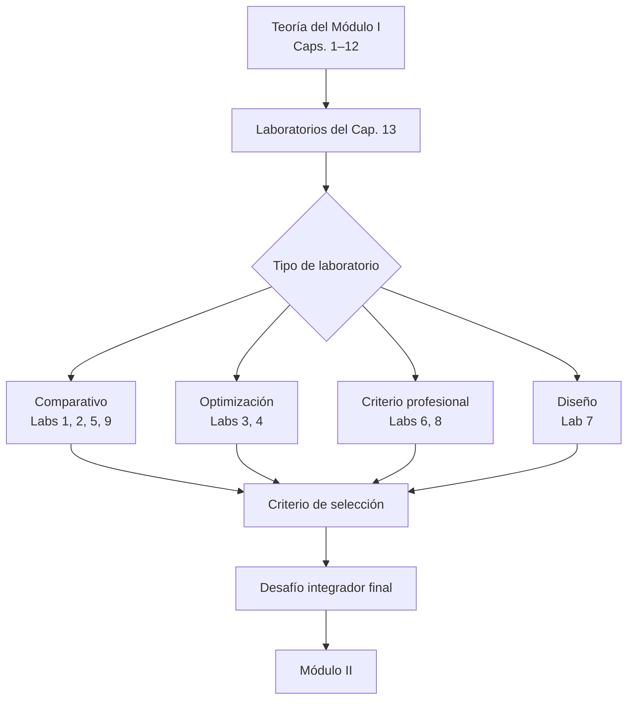
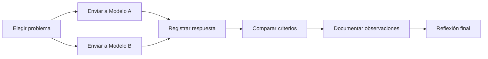
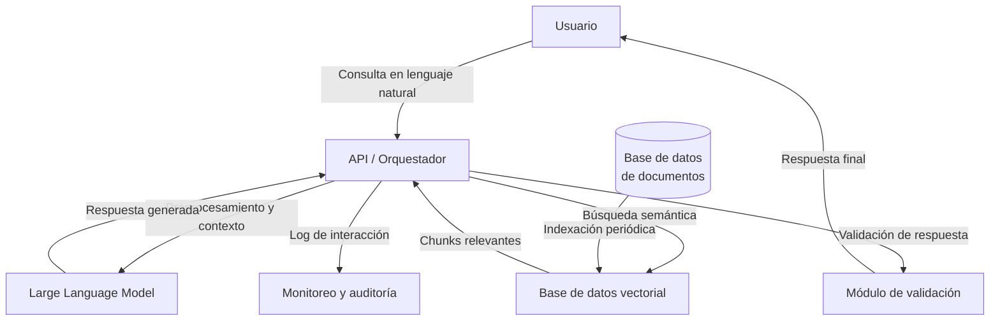

# Ingeniería de IA desde los Fundamentos

## Módulo I — Los Fundamentos de la Inteligencia Artificial

## Capítulo 13 — Laboratorios del Módulo I

**Versión:** 0.5 (Draft editorial)
**Estado:** En revisión

---

## 1. Objetivos del capítulo

Al finalizar este capítulo serás capaz de:

1. Aplicar los conceptos teóricos del Módulo I en situaciones concretas que imitan el trabajo real de un arquitecto de Inteligencia Artificial (IA).
2. Comparar el comportamiento de distintos Large Language Models (LLMs) ante un mismo problema y extraer criterio de selección.
3. Evaluar el impacto de parámetros como temperatura y longitud de prompt sobre la calidad de las respuestas.
4. Diseñar una arquitectura conceptual de IA para un caso real, identificando sus componentes y sus decisiones críticas.
5. Reconocer cuándo una solución de IA es apropiada y cuándo no lo es.
6. Desarrollar respuestas profesionales ante argumentos técnicos débiles o mal fundamentados.
7. Identificar alucinaciones en los modelos y distinguir entre confianza aparente y corrección real.

---

## 2. Introducción

Doce capítulos. Más de cien conceptos. Tokens, embeddings, ventanas de contexto, temperatura, Transformers, Retrieval-Augmented Generation (RAG), alucinaciones, arquitecturas.

Llegaste hasta aquí. Eso significa que tenés las bases. Lo que falta ahora no es más teoría. Lo que falta es usarla.

Este capítulo no presenta conceptos nuevos. Presenta situaciones que el lector deberá resolver con lo que ya sabe. Algunos ejercicios son comparativos: dos respuestas, un criterio para decidir. Otros son de diseño: un problema real, una arquitectura para resolverlo. Otros son de evaluación: una afirmación, una postura técnica fundamentada.

La diferencia entre alguien que leyó este libro y alguien que lo internalizó no está en la cantidad de conceptos que puede recitar. Está en la calidad de las decisiones que toma cuando el problema es ambiguo, el tiempo es escaso y las opciones son imperfectas.

Los laboratorios de este capítulo están diseñados exactamente para eso.

---

## 3. Propósito de los laboratorios

Los nueve laboratorios de este capítulo no son ejercicios académicos. Son simulaciones de situaciones reales.

En cada uno, el lector ocupa el rol del arquitecto o del ingeniero que debe decidir. No hay una única respuesta correcta. Hay respuestas mejor o peor fundamentadas. Hay decisiones que se pueden justificar y decisiones que no se pueden defender.

Cada laboratorio está vinculado al capítulo teórico del que proviene, de modo que si una pregunta genera dudas, el camino de vuelta está indicado.

---

## 4. Metodología

### Cómo sacar el máximo provecho de estos laboratorios

**Registrá todo.** El valor de un laboratorio no está en completarlo. Está en lo que observás durante el proceso. Cada diferencia entre modelos, cada resultado inesperado, cada momento en que una respuesta te sorprende: eso es información valiosa. Si no lo registrás, lo perdés.

**No busques la respuesta correcta.** Buscá la respuesta más fundamentada. En arquitectura de IA, dos decisiones distintas pueden ser ambas válidas si responden a contextos distintos. El error no es elegir diferente. El error es elegir sin criterio.

**Trabajá con al menos dos modelos distintos.** La comparación entre modelos es en sí misma un laboratorio. Un mismo prompt enviado a ChatGPT y a Claude puede producir respuestas muy distintas en forma, extensión, tono y precisión. Esa diferencia es el material de análisis.

**Hacé los laboratorios en orden la primera vez.** Están diseñados para construir criterio de forma progresiva. Los laboratorios iniciales (1 y 2) trabajan con observación. Los intermedios (3, 4, 5) trabajan con optimización. Los avanzados (6, 7, 8, 9) trabajan con criterio y diseño.

**Volvé a los capítulos cuando algo no esté claro.** Cada laboratorio indica el capítulo de referencia. Si una pregunta de reflexión no tiene respuesta, probablemente haya algo que necesita reforzarse.

---

## 5. Recomendaciones generales

Antes de comenzar:

- Utilizá al menos dos asistentes distintos. Se recomiendan ChatGPT y Claude como punto de partida; Gemini o un modelo local son valiosos como tercera opción.
- Tené a mano un documento para registrar observaciones. Puede ser un archivo de texto, una hoja de cálculo o un cuaderno físico.
- No busques validar lo que ya sabés. Buscá descubrir lo que no sabías que no sabías.
- Tratá cada resultado inesperado como una oportunidad de análisis, no como un error del modelo o tuyo.
- Si un laboratorio te resulta demasiado simple, hacé los desafíos opcionales. Si te resulta difícil, revisá el capítulo de referencia antes de continuar.

---

## 6. Laboratorio 1: Comparando modelos

**Capítulo de referencia:** Capítulo 2 — Qué es un LLM | Capítulo 7 — Modelos disponibles

### Objetivo

Observar de forma sistemática cómo distintos modelos responden a una misma solicitud, y desarrollar criterio para seleccionar el modelo más adecuado según el tipo de problema.

### Nivel

Inicial

### Tiempo estimado

45 a 60 minutos

### Herramientas

- ChatGPT (versión gratuita o Plus)
- Claude (versión gratuita o Pro)
- Gemini (opcional)
- Un modelo local mediante Ollama (opcional)

### Escenario

Tu equipo debe elegir un LLM para integrar en una aplicación de soporte técnico interno. El directivo que toma la decisión de compra preguntó: "¿No son todos más o menos iguales?" Tu trabajo es demostrar, con evidencia, que no lo son.

### Pasos

**Paso 1 — Elegir el prompt de prueba**

Elegí un prompt que tenga dos características: requiera razonamiento (no solo recuperación de información) y sea relevante para un contexto profesional real. Ejemplo:

> "Explicá cómo decidirías si un problema de negocio requiere IA o puede resolverse con reglas simples. Incluí al menos tres criterios de decisión."

**Por qué:** Un prompt demasiado simple no distingue modelos. Un prompt que requiere razonamiento y estructura expone diferencias reales en la forma en que cada modelo organiza y profundiza sus respuestas.

**Paso 2 — Ejecutar el mismo prompt en cada modelo sin modificaciones**

Enviá el prompt exactamente igual en cada herramienta. No corrijas ni aclares. Si el modelo pide aclaraciones, respondé "seguí con tu mejor interpretación".

**Por qué:** La variabilidad no controlada en el input contamina la comparación. El objetivo es observar diferencias en el output manteniendo el input constante.

**Paso 3 — Registrar las respuestas en la plantilla**

| Dimensión | ChatGPT | Claude | Gemini | Modelo local |
|---|---|---|---|---|
| Claridad del lenguaje (1–5) | | | | |
| Profundidad conceptual (1–5) | | | | |
| Organización y estructura (1–5) | | | | |
| Precisión técnica (1–5) | | | | |
| Facilidad de lectura (1–5) | | | | |
| Extensión de la respuesta (palabras aprox.) | | | | |
| Presencia de ejemplos (sí/no) | | | | |
| Tono (formal / conversacional / técnico) | | | | |
| Observación libre | | | | |

**Paso 4 — Analizar diferencias y patrones**

Con la tabla completada, identificá: ¿Qué modelo priorizó la estructura? ¿Cuál priorizó la profundidad? ¿Hubo alguno que respondió de forma más práctica y menos teórica? ¿Las diferencias son consistentes con las características que cada empresa documenta sobre su modelo?

**Paso 5 — Formular una recomendación**

Redactá un párrafo de no más de 150 palabras respondiendo: "Para una aplicación de soporte técnico interno con usuarios no técnicos, ¿cuál de los modelos evaluados elegirías y por qué?"

### Validación

El laboratorio fue exitoso si podés responder con fundamento: "Elegí el modelo X porque en las dimensiones Y y Z mostró consistentemente mejor desempeño, y esas dimensiones son las más relevantes para este caso de uso."

### Reflexión

- ¿Existe un modelo universalmente mejor, o la elección depende del contexto?
- ¿Qué dimensión resultó más difícil de evaluar objetivamente? ¿Por qué?
- Si el costo fuera el único criterio, ¿cambiaría tu elección? ¿A qué costo?
- ¿Qué información adicional necesitarías para hacer una comparación más rigurosa?

### Desafíos opcionales

1. Repetí el mismo prompt tres veces en el mismo modelo y registrá si las respuestas difieren. ¿Qué te dice eso sobre la reproducibilidad?
2. Usá un prompt completamente diferente (por ejemplo, una tarea de código) y verificá si el ranking de modelos cambia.
3. Pedile a cada modelo que evalúe su propia respuesta. ¿Qué dice sobre sus limitaciones?

---

## 7. Laboratorio 2: Temperatura y variabilidad

**Capítulo de referencia:** Capítulo 8 — Temperatura y sampling

### Objetivo

Comprender de forma práctica cómo la temperatura afecta la variabilidad, la creatividad y la precisión de las respuestas de un LLM.

### Nivel

Inicial

### Tiempo estimado

30 a 45 minutos

### Herramientas

- Playground de OpenAI (permite ajustar temperatura manualmente)
- API de Anthropic o acceso a configuración de temperatura
- Alternativamente: Ollama con modelo local

### Escenario

Estás evaluando qué configuración de temperatura aplicar en dos sistemas distintos: uno que genera código Python a partir de descripciones en lenguaje natural, y otro que genera ideas de nombres para productos. Necesitás evidencia para justificar configuraciones diferentes.

### Pasos

**Paso 1 — Elegir dos prompts con propósitos diferentes**

Prompt A (precisión técnica):
> "Escribí una función en Python que reciba una lista de enteros y devuelva la lista ordenada de mayor a menor sin usar sort()."

Prompt B (creatividad):
> "Generá cinco nombres posibles para una aplicación móvil que ayuda a las personas a organizar sus compras del supermercado."

**Paso 2 — Ejecutar cada prompt con tres valores de temperatura distintos**

Valores sugeridos: 0.1 (muy baja), 0.7 (media), 1.4 (alta). Ejecutá cada combinación al menos dos veces para observar variabilidad intra-temperatura.

**Por qué:** Un solo resultado por temperatura puede ser atípico. Dos resultados permiten detectar si la variabilidad es consistente con el nivel de temperatura.

**Paso 3 — Registrar observaciones**

| Temperatura | Prompt A — Código | Prompt B — Nombres |
|---|---|---|
| 0.1 — Ejecución 1 | | |
| 0.1 — Ejecución 2 | | |
| 0.7 — Ejecución 1 | | |
| 0.7 — Ejecución 2 | | |
| 1.4 — Ejecución 1 | | |
| 1.4 — Ejecución 2 | | |

Para cada celda registrá: ¿El código compila? ¿Los nombres son creativos? ¿Son similares entre sí?

**Paso 4 — Identificar el punto de quiebre**

¿A partir de qué temperatura el código deja de ser funcional? ¿A partir de qué temperatura los nombres empiezan a repetirse o a carecer de sentido?

### Validación

El laboratorio fue exitoso si podés completar: "Para generación de código recomendaría temperatura \_\_ porque \_\_. Para generación de ideas creativas recomendaría temperatura \_\_ porque \_\_."

### Reflexión

- ¿Temperatura alta siempre implica mejor creatividad, o hay un punto donde genera ruido?
- ¿Un sistema de producción debería permitir que el usuario controle la temperatura, o debería fijarla el equipo de ingeniería?
- ¿Qué otros parámetros de sampling deberías explorar para complementar lo que aprendiste sobre temperatura?

### Desafíos opcionales

1. Probá temperatura 0 (o el valor mínimo disponible) y verificá si las respuestas son completamente deterministas.
2. Explorá el parámetro top-p como alternativa a temperatura y comparate el efecto.
3. Diseñá un criterio de evaluación objetiva para decidir qué temperatura usar en un sistema de clasificación de tickets de soporte.

---

## 8. Laboratorio 3: Optimización de tokens

**Capítulo de referencia:** Capítulo 5 — Tokens y ventana de contexto

### Objetivo

Desarrollar criterio para optimizar prompts, reduciendo tokens sin sacrificar calidad de respuesta, y comprender el impacto directo sobre costo y velocidad.

### Nivel

Inicial a Intermedio

### Tiempo estimado

40 a 60 minutos

### Herramientas

- Tokenizer de OpenAI (platform.openai.com/tokenizer) para conteo
- Calculadora de costos de la API que uses
- ChatGPT o Claude para ejecutar los prompts

### Escenario

Tu aplicación de IA procesa 10.000 consultas por día. El prompt del sistema tiene actualmente 800 tokens. El arquitecto senior sugiere revisarlo. Antes de modificar producción, necesitás evidencia de que la reducción no degrada la calidad.

### Pasos

**Paso 1 — Elegir un prompt extenso como punto de partida**

Escribí o seleccioná un prompt de al menos 300 tokens que incluya instrucciones de rol, formato de respuesta esperado, ejemplos y restricciones. Ejemplo:

> "Sos un asistente de soporte técnico especializado en software de gestión empresarial. Tu objetivo es ayudar a usuarios no técnicos a resolver problemas de acceso, configuración y uso de la plataforma. Siempre que respondas, seguí este formato: primero identificá el problema en una oración, luego ofrecé tres pasos concretos enumerados, luego preguntá si la solución fue efectiva. Nunca supongas que el usuario tiene conocimientos técnicos. No uses jerga. No des respuestas de más de 150 palabras. No menciones la posibilidad de escalar a otro equipo a menos que los tres pasos hayan fallado."

**Paso 2 — Contabilizar los tokens del prompt original**

Usá el tokenizer para obtener el número exacto de tokens. Anotá el valor.

**Paso 3 — Reescribir el prompt reduciendo al menos un 40% de los tokens**

Objetivo: mantener la intención y el comportamiento esperado, pero con menos palabras. Eliminá redundancias, simplificá frases y reorganizá instrucciones.

**Paso 4 — Comparar las respuestas con el mismo input de usuario**

Usá el siguiente mensaje de prueba: "No puedo entrar al sistema, me dice que mi contraseña venció pero cuando la cambio sigue sin dejarme entrar."

Enviá ese mensaje con el prompt original y con el prompt reducido. Completá la tabla:

| Dimensión | Prompt original | Prompt reducido |
|---|---|---|
| Tokens del prompt de sistema | | |
| Costo estimado por 10.000 consultas/día (USD) | | |
| La respuesta sigue el formato solicitado (sí/no) | | |
| La respuesta es comprensible para un usuario no técnico (1–5) | | |
| La respuesta es correcta técnicamente (1–5) | | |
| Diferencia observable en calidad | | |

**Paso 5 — Calcular el ahorro proyectado**

Si la diferencia de tokens es N por consulta, con 10.000 consultas diarias y el precio por token del modelo elegido, ¿cuánto representa mensualmente? ¿Y anualmente?

### Validación

El laboratorio fue exitoso si podés responder: "Reduje el prompt de X a Y tokens (Z% de reducción). La calidad de las respuestas [se mantuvo / mejoró / degradó] porque \_\_. El ahorro proyectado anual es aproximadamente USD \_\_."

### Reflexión

- ¿Toda información en el prompt original era necesaria, o había redundancias?
- ¿Existe un punto por debajo del cual reducir más tokens empieza a degradar el comportamiento?
- ¿Cómo cambiaría tu enfoque si el modelo tuviera una ventana de contexto de 4.096 tokens en lugar de 128.000?

### Desafíos opcionales

1. Probá reducir el prompt a menos de la mitad. ¿Cuándo se rompe el comportamiento?
2. Medí el tiempo de respuesta del modelo con el prompt original vs. el reducido. ¿Hay diferencia observable?
3. Diseñá una estrategia de versionado de prompts para un equipo de ingeniería que trabaja sobre el mismo sistema.

---

## 9. Laboratorio 4: Gestión de contexto

**Capítulo de referencia:** Capítulo 5 — Tokens y ventana de contexto | Capítulo 9 — Memoria y contexto

### Objetivo

Identificar en la práctica cuándo un LLM comienza a perder referencias en conversaciones largas, y evaluar estrategias para mantener la coherencia.

### Nivel

Intermedio

### Tiempo estimado

60 a 90 minutos

### Herramientas

- ChatGPT (interfaz de chat) o Claude
- Documento para registrar el punto de degradación

### Escenario

Estás diseñando un asistente conversacional para un proceso de onboarding de empleados. El proceso implica una conversación de 30 a 40 turnos en los que el usuario responde preguntas, el asistente recuerda respuestas anteriores y construye sobre ellas. Necesitás entender cuándo el modelo empieza a perder esa coherencia.

### Pasos

**Paso 1 — Iniciar una conversación con contexto inicial cargado**

Comenzá la conversación estableciendo información que el modelo debería recordar. Ejemplo:

> "Me llamo Alejandro. Soy programador con 8 años de experiencia en Java. Trabajo en una empresa de logística. Mi objetivo es aprender sobre IA aplicada a optimización de rutas. Mi mayor limitación es el tiempo: solo puedo dedicar 2 horas semanales al estudio."

**Paso 2 — Extender la conversación durante 20 a 30 turnos**

Continúa haciendo preguntas sobre temas relacionados, pero sin volver a mencionar los datos del contexto inicial. Después del turno 10, empezá a incluir referencias implícitas. Ejemplos:

- Turno 15: "¿Qué me recomendarías dado mi nivel de experiencia?"
- Turno 22: "¿Cuánto tiempo necesitaría para aprender esto correctamente?"
- Turno 28: "¿Cómo aplicaría esto a mi industria?"

**Paso 3 — Registrar el punto de degradación**

| Turno | Pregunta con referencia implícita | El modelo recordó el contexto (sí/no/parcialmente) | Observación |
|---|---|---|---|
| 15 | Nivel de experiencia | | |
| 22 | Disponibilidad de tiempo | | |
| 28 | Industria de trabajo | | |
| 35+ | Nombre del usuario | | |

**Paso 4 — Probar estrategias de recuperación**

Cuando el modelo empiece a perder contexto, probá estas tres estrategias y registrá cuál es más efectiva:

- **Estrategia A:** Resumí la conversación en un párrafo e inyectalo como primer mensaje de una nueva sesión.
- **Estrategia B:** En el mismo chat, enviá un mensaje recordatorio con los datos clave al inicio del turno problemático.
- **Estrategia C:** Reorganizá el prompt inicial para incluir los datos más importantes en formato estructurado (lista o tabla).

### Validación

El laboratorio fue exitoso si identificaste con precisión en qué turno aproximado el modelo comenzó a degradar y cuál de las tres estrategias produjo la recuperación más natural del contexto.

### Reflexión

- ¿La degradación fue abrupta o gradual?
- ¿Qué tipo de información se perdió primero: nombres, números o conceptos abstractos?
- ¿Cómo diseñarías la arquitectura de memoria de un asistente conversacional para evitar este problema en producción?
- ¿Qué rol podría cumplir una base de datos externa para complementar la ventana de contexto?

### Desafíos opcionales

1. Repetí el experimento con un modelo diferente. ¿El punto de degradación ocurre en el mismo turno?
2. Diseñá un prompt de sistema que instruya explícitamente al modelo a pedir confirmación de contexto cada cierto número de turnos.
3. Investigá la técnica de "sliding window" para manejo de contexto y describí cómo la implementarías.

---

## 10. Laboratorio 5: Búsqueda semántica vs. búsqueda por palabras clave

**Capítulo de referencia:** Capítulo 10 — Embeddings y búsqueda semántica

### Objetivo

Comprender de forma práctica por qué la búsqueda semántica supera a la búsqueda por palabras clave en dominios donde los usuarios expresan la misma necesidad con vocabulario variado.

### Nivel

Intermedio

### Tiempo estimado

45 a 60 minutos

### Herramientas

- Un LLM como asistente para generar variantes
- Un documento o base de conocimiento simulada
- Opcionalmente: un motor de búsqueda por keyword (ctrl+F) para demostrar el contraste

### Escenario

Tu empresa tiene un manual de procedimientos interno de 200 páginas. Los empleados lo consultan frecuentemente, pero las búsquedas por palabras no encuentran lo que buscan. La dirección evalúa implementar un sistema RAG. Antes de aprobar el presupuesto, te piden evidencia del problema que se pretende resolver.

### Pasos

**Paso 1 — Elegir una necesidad de información concreta**

Seleccioná una pregunta que un empleado podría necesitar responder consultando el manual. Ejemplo: "¿Cómo solicito días de licencia por enfermedad?"

**Paso 2 — Generar cinco variantes de la misma pregunta**

Pedile al LLM que genere cinco formas distintas de preguntar exactamente lo mismo. Ejemplo:

| Variante | Texto |
|---|---|
| 1 | ¿Cómo solicito días de licencia por enfermedad? |
| 2 | Me siento mal, ¿qué tengo que hacer para faltar al trabajo? |
| 3 | Procedimiento para ausentarme por motivos médicos |
| 4 | Baja médica: pasos a seguir |
| 5 | ¿Qué hago si tengo que ir al médico en horario laboral? |

**Paso 3 — Analizar qué encontraría una búsqueda por palabras clave**

Para cada variante, identificá las palabras clave que usaría un buscador estándar. Luego respondé: si el documento usa la frase "licencia por razones de salud", ¿cuántas de las cinco variantes la encontrarían con búsqueda literal?

| Variante | Palabras clave extraídas | ¿Coincidiría con búsqueda literal? (sí/no/parcialmente) |
|---|---|---|
| 1 | licencia, enfermedad | Parcialmente |
| 2 | faltar, trabajo | No |
| 3 | ausentarme, médico | No |
| 4 | baja médica | No |
| 5 | médico, horario laboral | No |

**Paso 4 — Analizar qué encontraría una búsqueda semántica**

Explicá con tus palabras por qué un sistema de embeddings podría recuperar el documento correcto en todos los casos. ¿Qué representa el vector de cada variante? ¿Por qué su proximidad en el espacio vectorial indica similitud semántica aunque las palabras sean distintas?

**Paso 5 — Formular el caso de negocio**

Redactá un párrafo de no más de 200 palabras explicando a un directivo no técnico por qué implementar búsqueda semántica en lugar de búsqueda por palabras clave, usando el análisis anterior como evidencia.

### Validación

El laboratorio fue exitoso si podés explicar, sin consultar el libro, por qué la búsqueda por palabras clave falla en escenarios de vocabulario variado y cómo los embeddings resuelven ese problema de forma estructural.

### Reflexión

- ¿En qué casos la búsqueda por palabras clave sería suficiente o incluso preferible a la semántica?
- ¿Qué ocurre cuando dos frases tienen palabras similares pero significados opuestos? ¿Los embeddings resuelven eso?
- ¿Cómo mediría el éxito de un sistema de búsqueda semántica en producción?

### Desafíos opcionales

1. Investigá la métrica de similitud coseno y explicá por qué se usa para comparar embeddings.
2. Describí cómo una empresa con documentación en español e inglés podría implementar búsqueda semántica multilingüe.
3. ¿Qué riesgos tendría un sistema RAG basado en búsqueda semántica si la base de documentos contiene información desactualizada?

---

## 11. Laboratorio 6: ¿Necesita IA?

**Capítulo de referencia:** Capítulo 11 — Cuándo usar IA y cuándo no

### Objetivo

Desarrollar criterio profesional para evaluar si una aplicación o proceso realmente requiere IA, o si puede resolverse de forma más simple, más barata y más confiable con reglas deterministas.

### Nivel

Intermedio

### Tiempo estimado

60 a 90 minutos

### Herramientas

- Ninguna herramienta técnica requerida
- Un documento para registrar el análisis

### Escenario

Sos el arquitecto responsable de una auditoría tecnológica. La dirección propuso "incorporar IA" a cinco aplicaciones de la organización para modernizar el portafolio. Tu trabajo es evaluar cada caso con rigor técnico y dar una recomendación fundamentada.

### Pasos

**Paso 1 — Seleccionar cinco aplicaciones o procesos reales**

Elegí cinco sistemas o procesos de tu organización actual o de una organización que conozcas bien. Si no tenés acceso a un contexto organizacional concreto, usá los siguientes ejemplos:

1. Sistema de alerta que notifica cuando el stock de un producto cae por debajo de X unidades.
2. Clasificación de emails entrantes en categorías: soporte, facturación, ventas, otros.
3. Generación automática de respuestas a preguntas frecuentes de clientes.
4. Cálculo del descuento a aplicar según el volumen de compra y el segmento del cliente.
5. Detección de comentarios ofensivos en un foro interno de empleados.

**Paso 2 — Evaluar cada caso con el framework de cuatro preguntas**

Para cada aplicación, respondé honestamente:

| Aplicación | ¿Existe un problema real que IA podría resolver mejor? | ¿Puede resolverse con reglas deterministas? | ¿Los beneficios justifican la complejidad añadida? | ¿Qué riesgos introduciría la IA? | Decisión recomendada |
|---|---|---|---|---|---|
| 1 | | | | | |
| 2 | | | | | |
| 3 | | | | | |
| 4 | | | | | |
| 5 | | | | | |

**Paso 3 — Clasificar cada caso**

Para cada aplicación asigná una categoría:
- **IA recomendada:** El problema es genuinamente ambiguo o variable y los beneficios superan los riesgos.
- **Reglas suficientes:** El problema puede resolverse con lógica determinista más barata y confiable.
- **Más información necesaria:** La decisión depende de datos adicionales que no están disponibles.

**Paso 4 — Redactar recomendaciones**

Para los casos donde la IA está recomendada, describí brevemente qué tipo de IA (clasificación, generación, RAG, etc.) y cuál sería el mayor riesgo a mitigar. Para los casos donde las reglas son suficientes, explicá por qué la simplicidad es la decisión correcta.

### Validación

El laboratorio fue exitoso si lograste al menos un caso donde claramente "las reglas son suficientes" y podés argumentarlo frente a alguien que quiere incorporar IA a ese proceso.

### Reflexión

- ¿Tendiste a recomendar IA en más casos de los necesarios, o a ser conservador? ¿Por qué?
- ¿Qué información adicional habría cambiado alguna de tus decisiones?
- ¿Cómo presentarías una recomendación de "no usar IA" a un directivo que ya tomó la decisión de implementarla?

### Desafíos opcionales

1. Investigá el concepto de "AI tax" y cómo se aplica a la toma de decisiones de adopción.
2. Diseñá un scorecard de 10 preguntas que cualquier equipo de tu organización pueda usar antes de proponer una solución de IA.
3. Analizá un caso público de falla de IA (por ejemplo, Amazon Rekognition en contexto policial) usando el mismo framework de cuatro preguntas.

---

## 12. Laboratorio 7: Diseño de arquitectura

**Capítulo de referencia:** Capítulo 12 — Arquitecturas de IA aplicadas

### Objetivo

Diseñar una arquitectura conceptual completa para un sistema de IA real, identificando todos los componentes, sus interacciones y las decisiones de diseño que justifican cada elección.

### Nivel

Avanzado

### Tiempo estimado

90 a 120 minutos

### Herramientas

- Herramienta de diagramas (draw.io, Lucidchart, papel o Mermaid)
- Documento para registrar decisiones de diseño

### Escenario

Seleccioná uno de los siguientes casos. Todos tienen suficiente complejidad para ejercitar las decisiones arquitectónicas relevantes:

**Opción A:** Asistente de documentación técnica. Los desarrolladores de una empresa preguntan en lenguaje natural sobre los sistemas internos, y el asistente responde consultando la documentación actualizada.

**Opción B:** Consulta a Data Warehouse en lenguaje natural. Los analistas de negocio realizan preguntas sobre los datos históricos sin necesitar SQL.

**Opción C:** Mesa de ayuda con triaje inteligente. Las consultas de empleados son clasificadas automáticamente, respondidas si corresponde a una FAQ conocida, o derivadas al equipo correcto si no.

**Opción D:** Clasificación automática de expedientes. Un organismo público recibe expedientes administrativos y necesita clasificarlos por tipo, prioridad y área responsable.

### Pasos

**Paso 1 — Definir el problema con precisión**

Antes de diseñar, describí el problema con exactitud. Completá:
- ¿Quién es el usuario final?
- ¿Qué input proporciona?
- ¿Qué output espera recibir?
- ¿Con qué frecuencia?
- ¿En qué contexto?

**Paso 2 — Identificar los componentes necesarios**

Listá todos los componentes que la solución requiere. Como mínimo evaluá la necesidad de:
- Interfaz de usuario
- API o capa de orquestación
- LLM (¿cuál?, ¿hospedado o local?)
- Base de datos vectorial (¿es necesaria RAG?)
- Base de datos relacional o documental (para datos estructurados)
- Sistema de validación de respuestas
- Sistema de logging y monitoreo
- Capa de autenticación y autorización

**Paso 3 — Diseñar el flujo de datos**

Dibujá (o describí con texto estructurado) el recorrido de una consulta desde el usuario hasta la respuesta. Para cada transición entre componentes indicá: ¿qué datos viajan?, ¿en qué formato?, ¿qué validaciones se aplican?

**Paso 4 — Justificar cada decisión**

Para cada componente elegido, respondé: ¿Por qué este y no una alternativa más simple? Si elegiste RAG, ¿por qué no fine-tuning? Si elegiste un modelo hospedado, ¿qué implicancias tiene para la privacidad de los datos?

| Componente | Decisión tomada | Alternativa descartada | Justificación |
|---|---|---|---|
| LLM | | | |
| Almacenamiento | | | |
| Búsqueda | | | |
| Validación | | | |
| Monitoreo | | | |

**Paso 5 — Identificar los tres mayores riesgos**

Para la arquitectura diseñada, identificá los tres problemas más probables en producción y describí cómo los mitigarías.

### Validación

El laboratorio fue exitoso si la arquitectura que diseñaste puede ser explicada en 5 minutos a un desarrollador senior sin referencias al libro o a la teoría, y si podés justificar cada componente con un argumento técnico concreto.

### Reflexión

- ¿Qué componente resultó más difícil de diseñar? ¿Por qué?
- ¿Cambiarías alguna decisión si el sistema debiera procesar datos confidenciales o regulados?
- ¿Cuál es el componente más crítico para el correcto funcionamiento del sistema?
- ¿Cómo escalaría esta arquitectura si la cantidad de usuarios se multiplicara por 10?

### Desafíos opcionales

1. Agregá a la arquitectura un componente de evaluación continua de calidad de respuestas y describí cómo funcionaría.
2. Diseñá la misma solución pero con restricción de no poder usar servicios externos. ¿Qué cambia?
3. Estimá los costos mensuales de la arquitectura diseñada para 1.000 usuarios activos diarios.

---

## 13. Laboratorio 8: Pensar como arquitecto

**Capítulo de referencia:** Capítulo 11 — Cuándo usar IA | Capítulo 12 — Arquitecturas aplicadas

### Objetivo

Desarrollar la capacidad de responder profesionalmente a argumentos técnicamente débiles o mal fundamentados, un escenario cotidiano en el trabajo de un arquitecto de IA.

### Nivel

Avanzado

### Tiempo estimado

60 a 90 minutos

### Herramientas

- Ninguna herramienta técnica requerida

### Escenario

Formas parte del equipo técnico de una empresa que está evaluando su estrategia de IA. En una reunión con directivos y líderes de área, escuchás cuatro afirmaciones que requieren una respuesta técnica fundamentada. Tu trabajo es responder sin confrontar innecesariamente, pero sin validar premisas falsas.

### Pasos

**Paso 1 — Leer cada caso con atención**

Antes de escribir, identificá el problema técnico real detrás de cada afirmación. No todas son igualmente erróneas. Algunas son simplificaciones. Otras son razonamientos directamente incorrectos.

**Paso 2 — Redactar una respuesta para cada caso**

Cada respuesta debe:
- Reconocer el interés o la preocupación legítima detrás de la afirmación.
- Identificar el error o la simplificación con precisión.
- Proponer una perspectiva técnica mejor fundamentada.
- Tener un tono profesional y colaborativo, no condescendiente.

**Caso A — "Necesitamos IA porque todas las empresas la están implementando."**

| Elemento | Tu análisis |
|---|---|
| ¿Qué hay de válido en esta afirmación? | |
| ¿Cuál es el error de razonamiento? | |
| ¿Qué pregunta devolvería el control a la evidencia? | |
| Tu respuesta en 3 a 5 oraciones | |

**Caso B — "Compremos el modelo más grande y más potente disponible."**

| Elemento | Tu análisis |
|---|---|
| ¿Qué hay de válido en esta afirmación? | |
| ¿Cuál es el error de razonamiento? | |
| ¿Qué preguntas harías antes de elegir un modelo? | |
| Tu respuesta en 3 a 5 oraciones | |

**Caso C — "Subamos todos nuestros documentos al modelo."**

| Elemento | Tu análisis |
|---|---|
| ¿Qué hay de válido en esta afirmación? | |
| ¿Cuál es el error de razonamiento? | |
| ¿Qué alternativa técnica propondrías? | |
| Tu respuesta en 3 a 5 oraciones | |

**Caso D — "Si el modelo respondió, debe ser correcto."**

| Elemento | Tu análisis |
|---|---|
| ¿Qué hay de válido en esta afirmación? | |
| ¿Cuál es el error de razonamiento? | |
| ¿Qué mecanismos de validación propondrías? | |
| Tu respuesta en 3 a 5 oraciones | |

**Paso 3 — Revisar el conjunto de respuestas**

Una vez que escribiste las cuatro respuestas, releelas como un conjunto. ¿Hay algún tema común que aparece en varias? ¿Existe una tensión recurrente que un arquitecto de IA debe saber manejar?

### Validación

El laboratorio fue exitoso si alguien que lea tus cuatro respuestas concluye que provienen de alguien con criterio técnico genuino, no de alguien que memorizó definiciones.

### Reflexión

- ¿Cuál de los cuatro casos te resultó más difícil de responder? ¿Por qué?
- ¿En alguno de los casos el directivo podría tener razón, dependiendo del contexto?
- ¿Cómo cambia la respuesta si quien hace la afirmación es el CEO en lugar de un colega técnico?

### Desafíos opcionales

1. Inventá un quinto caso con una afirmación igualmente problemática y escribí tu respuesta.
2. Pedile a un LLM que genere la peor respuesta posible a cada caso. ¿Qué patrones reconocés?
3. Redactá un documento de una página que podría enviarse como lectura previa a un directivo antes de una reunión de estrategia de IA.

---

## 14. Laboratorio 9: Evaluación de alucinaciones

**Capítulo de referencia:** Capítulo 6 — Alucinaciones y límites de los LLMs

### Objetivo

Desarrollar criterio para identificar cuándo un modelo genera información incorrecta con alta confianza aparente, y diseñar estrategias de validación apropiadas para contextos críticos.

### Nivel

Avanzado

### Tiempo estimado

60 a 90 minutos

### Herramientas

- ChatGPT, Claude o Gemini
- Fuentes de referencia verificables (Wikipedia, documentación oficial, publicaciones académicas)
- Documento para registrar los resultados

### Escenario

Tu empresa está evaluando usar un LLM para responder preguntas técnicas y legales en un portal de autoservicio. El responsable legal pregunta: "¿Cómo sabemos que las respuestas del modelo son correctas?" Necesitás diseñar una metodología de evaluación y demostrarla.

### Pasos

**Paso 1 — Formular diez preguntas con respuesta verificable**

Elegí preguntas en dominios donde la respuesta correcta sea comprobable. Incluí preguntas de distintos tipos:
- Hechos históricos con fechas específicas
- Normas legales o técnicas vigentes
- Especificaciones técnicas de productos conocidos
- Resultados de investigaciones publicadas

Ejemplo de preguntas:

1. ¿En qué año se publicó el paper "Attention Is All You Need" y quiénes son sus autores?
2. ¿Cuál es el límite de tokens de contexto del modelo GPT-4 Turbo en su versión con 128k?
3. ¿Qué artículo del GDPR regula el derecho al olvido?
4. ¿Cuántos parámetros tiene el modelo Llama 3.1 en su versión de 70 mil millones de parámetros?
5. ¿En qué país se fundó la empresa DeepMind antes de ser adquirida por Google?

**Paso 2 — Formular también tres preguntas trampa**

Incluí preguntas cuya premisa sea falsa para observar si el modelo la corrige o la acepta:

- "¿Qué modelo de OpenAI ganó el Nobel de Informática en 2024?"
- "¿Cuándo publicó Meta su modelo de lenguaje Gemini?"
- "¿Qué versión de Python es requerida por el framework TensorFlow 2.0 exclusivamente?"

**Paso 3 — Registrar respuestas y verificarlas**

| Pregunta | Respuesta del modelo | Respuesta correcta (fuente) | Correcta (sí/no/parcialmente) | Confianza aparente del modelo (1–5) | Inconsistencia entre confianza y corrección |
|---|---|---|---|---|---|
| 1 | | | | | |
| 2 | | | | | |
| 3 | | | | | |
| Trampa 1 | | | | | |
| Trampa 2 | | | | | |
| Trampa 3 | | | | | |

**Paso 4 — Identificar patrones de alucinación**

Con la tabla completada, analizá:
- ¿En qué tipo de preguntas el modelo alucinó con mayor frecuencia?
- ¿El modelo mostró mayor confianza en las respuestas incorrectas o en las correctas?
- ¿Aceptó las premisas falsas de las preguntas trampa o las cuestionó?

**Paso 5 — Proponer una estrategia de mitigación**

Basándote en lo observado, redactá una estrategia de tres a cinco puntos para reducir el riesgo de alucinaciones en el portal de autoservicio. Evaluá la viabilidad y las limitaciones de cada punto.

### Validación

El laboratorio fue exitoso si podés responder con evidencia concreta al responsable legal: "Evaluamos el modelo con X preguntas. En Y% de los casos la respuesta fue correcta. Identificamos que el modelo tiende a alucinar especialmente en [tipo de pregunta]. Proponemos las siguientes medidas de mitigación para reducir ese riesgo."

### Reflexión

- ¿La confianza aparente del modelo correlacionó con la corrección real?
- ¿Qué mecanismos del modelo producen este fenómeno de alucinación con confianza alta?
- ¿En qué tipos de aplicaciones el riesgo de alucinación es inaceptable sin validación adicional?
- ¿Qué le responderías a alguien que propone confiar en el modelo porque "tiene 90% de precisión en evaluaciones internas"?

### Desafíos opcionales

1. Repetí el experimento con un segundo modelo y comparate las tasas de alucinación. ¿Son iguales? ¿En qué tipos de preguntas difieren?
2. Investigá la técnica de "grounding" y explicá cómo un sistema RAG puede reducir, aunque no eliminar, el riesgo de alucinaciones.
3. Diseñá un flujo de validación automática que compare la respuesta del LLM con una fuente de datos confiable para preguntas factuales.

---

## 15. Desafío integrador final

**Capítulo de referencia:** Todos los capítulos del Módulo I

Este desafío cierra el Módulo I. No es un laboratorio más. Es la demostración de que el lector puede pensar como un arquitecto de IA.

### Enunciado

Elegí un problema real de tu organización, de tu proyecto actual o de un contexto profesional que conozcas en profundidad. Si no tenés uno disponible, usá el siguiente:

> Una empresa de seguros recibe 3.000 consultas por semana de sus clientes sobre el estado de sus pólizas, cobertura de siniestros y fechas de vencimiento. El 60% de esas consultas podrían responderse con información ya disponible en sus sistemas. El 40% requiere intervención humana. El tiempo promedio de respuesta actual es de 48 horas. La dirección quiere reducirlo a menos de 2 horas para el 60% de consultas autogestionables.

### Preguntas que debe responder tu solución

**1. Definición del problema**
¿Existe realmente un problema que IA puede resolver? ¿Qué evidencia tenés de que el problema es real y que su costo justifica la inversión?

**2. Decisión sobre IA**
¿Conviene usar IA en este caso? ¿Qué parte del problema requiere IA y qué parte puede resolverse con reglas simples? ¿Qué tipo de IA es la más adecuada?

**3. Arquitectura propuesta**
Describí los componentes principales de la solución. Incluí un diagrama Mermaid con el flujo de datos. Justificá cada decisión de diseño con al menos un argumento técnico.

**4. Selección de modelo**
¿Qué modelo elegirías y por qué? ¿Hospedado o local? ¿Grande o pequeño? ¿Fine-tuning o RAG? ¿Qué criterios determinaron esa elección?

**5. Riesgos identificados**
Listá los tres riesgos principales. Para cada uno: ¿qué probabilidad le asignás? ¿Qué impacto tendría si se materializa? ¿Cómo lo mitigarías?

**6. Medición del éxito**
¿Cómo sabrías que la solución funcionó? Definí al menos tres métricas específicas, medibles y con un valor objetivo.

### Formato de entrega

El desafío puede entregarse como:
- Un documento de una a tres páginas
- Una presentación de cinco a ocho diapositivas
- Un diagrama anotado con referencias a cada punto

Lo importante no es el formato. Lo importante es que cada decisión esté fundamentada.

---

## 16. Checklist del Módulo I

Al finalizar el Módulo I deberías poder responder estas diez preguntas sin consultar el libro. Si alguna genera dudas, el capítulo correspondiente está indicado.

| # | Pregunta | Capítulo de referencia |
|---|---|---|
| 1 | ¿Qué es la Inteligencia Artificial y en qué se diferencia de Machine Learning y Deep Learning? | Cap. 1 y Cap. 4 |
| 2 | ¿Qué es un Transformer y por qué cambió radicalmente el campo del procesamiento de lenguaje? | Cap. 3 |
| 3 | ¿Qué es un Large Language Model y cómo genera texto de forma estadística? | Cap. 2 |
| 4 | ¿Qué es un token y qué implicancias prácticas tiene la tokenización para el diseño de sistemas? | Cap. 5 |
| 5 | ¿Qué es la ventana de contexto y qué ocurre cuando se agota? | Cap. 5 |
| 6 | ¿Qué son los embeddings y para qué se usan en aplicaciones de IA? | Cap. 10 |
| 7 | ¿Qué función cumple la temperatura en la generación de texto y cuándo conviene ajustarla? | Cap. 8 |
| 8 | ¿Qué es una alucinación en un LLM y por qué ocurre estructuralmente? | Cap. 6 |
| 9 | ¿Qué es RAG y cuándo es preferible a fine-tuning para incorporar conocimiento específico? | Cap. 12 |
| 10 | ¿Cuáles son los tres criterios principales para decidir si un problema requiere IA? | Cap. 11 |

Si respondiste todas con confianza: estás listo para el Módulo II.

Si alguna genera dudas: revisá el capítulo correspondiente. No continúes con el Módulo II hasta sentirte cómodo con estas diez preguntas. La solidez en los fundamentos determina la calidad del trabajo en niveles más avanzados.

---

## 17. Autoevaluación de competencias

Esta escala está diseñada para que el lector evalúe su propio nivel en cada competencia del Módulo I. No es un examen. Es un mapa de dónde estás y hacia dónde vas.

### Cómo usar la escala

Para cada competencia, elegí el nivel que mejor describe tu situación actual. Sé honesto: subestimarte no ayuda, pero sobreestimarte tampoco.

**Escala:**
- **Nivel 1 — Exposición:** Escuché el concepto pero no podría explicarlo ni aplicarlo.
- **Nivel 2 — Comprensión:** Entiendo el concepto y puedo explicarlo con ejemplos simples.
- **Nivel 3 — Aplicación:** Puedo aplicar el concepto a situaciones nuevas con algo de esfuerzo.
- **Nivel 4 — Análisis:** Puedo comparar opciones, identificar trade-offs y justificar decisiones.
- **Nivel 5 — Síntesis:** Puedo diseñar soluciones complejas integrando múltiples conceptos y enseñar a otros.

---

### Competencias del Módulo I

**Competencia 1: Fundamentos de IA**

| Nivel | Descripción |
|---|---|
| 1 | Sé que existe IA, ML y DL pero no podría explicar la diferencia. |
| 2 | Puedo explicar la diferencia entre IA, Machine Learning (ML), Deep Learning (DL) y LLM con un ejemplo para cada uno. |
| 3 | Puedo ubicar un problema concreto en la jerarquía IA→ML→DL→LLM y justificar por qué pertenece a ese nivel. |
| 4 | Puedo analizar por qué cada nivel de la jerarquía surgió como respuesta a las limitaciones del anterior. |
| 5 | Puedo enseñar estos conceptos a un público no técnico y a un público técnico con el nivel de profundidad adecuado para cada uno. |

**Mi nivel actual:** \_\_\_ / 5

---

**Competencia 2: Tokenización y ventana de contexto**

| Nivel | Descripción |
|---|---|
| 1 | Sé que los modelos usan tokens pero no tengo claro qué son. |
| 2 | Puedo explicar qué es un token y estimar su cantidad en un texto dado. |
| 3 | Puedo estimar el costo aproximado de una interacción y diseñar prompts considerando el uso de tokens. |
| 4 | Puedo diagnosticar problemas de calidad causados por ventana de contexto agotada y proponer soluciones. |
| 5 | Puedo diseñar la estrategia de gestión de contexto para un sistema conversacional en producción, incluyendo truncado, resumen y ventana deslizante. |

**Mi nivel actual:** \_\_\_ / 5

---

**Competencia 3: Parámetros de generación**

| Nivel | Descripción |
|---|---|
| 1 | Escuché hablar de temperatura pero no sé exactamente qué hace. |
| 2 | Puedo explicar qué hace la temperatura y dar un ejemplo de cuándo conviene alta y cuándo baja. |
| 3 | Puedo elegir un valor de temperatura apropiado para un caso de uso dado y justificarlo. |
| 4 | Puedo comparar temperatura, top-p y top-k y analizar sus efectos combinados sobre la generación. |
| 5 | Puedo diseñar la configuración de parámetros de un sistema de producción para múltiples casos de uso con distintos requerimientos. |

**Mi nivel actual:** \_\_\_ / 5

---

**Competencia 4: Alucinaciones y limitaciones**

| Nivel | Descripción |
|---|---|
| 1 | Sé que los modelos pueden equivocarse pero no entiendo por qué. |
| 2 | Puedo explicar qué es una alucinación y dar un ejemplo. |
| 3 | Puedo identificar en qué tipos de preguntas un modelo es más propenso a alucinar. |
| 4 | Puedo diseñar estrategias de validación para reducir el impacto de las alucinaciones en un sistema. |
| 5 | Puedo diseñar un pipeline de evaluación continua de calidad que detecte alucinaciones en producción de forma automatizada. |

**Mi nivel actual:** \_\_\_ / 5

---

**Competencia 5: Embeddings y búsqueda semántica**

| Nivel | Descripción |
|---|---|
| 1 | Escuché el término embeddings pero no tengo claro qué representan. |
| 2 | Puedo explicar qué es un embedding y por qué permite búsqueda semántica. |
| 3 | Puedo describir el flujo completo de un sistema de búsqueda semántica: indexación, consulta y recuperación. |
| 4 | Puedo comparar búsqueda semántica con búsqueda por palabras clave y elegir la apropiada según el caso. |
| 5 | Puedo diseñar un sistema RAG completo con embeddings, base de datos vectorial, recuperación y generación, justificando cada decisión de diseño. |

**Mi nivel actual:** \_\_\_ / 5

---

**Competencia 6: Criterio de adopción de IA**

| Nivel | Descripción |
|---|---|
| 1 | No tengo criterios claros para decidir cuándo usar IA. |
| 2 | Puedo nombrar dos o tres criterios para evaluar si un problema requiere IA. |
| 3 | Puedo aplicar un framework de evaluación a un caso concreto y llegar a una recomendación fundamentada. |
| 4 | Puedo comparar IA versus reglas deterministas en escenarios ambiguos y justificar la elección considerando costo, riesgo y mantenibilidad. |
| 5 | Puedo liderar la evaluación de adopción de IA en una organización, definiendo el proceso, los criterios y los mecanismos de validación. |

**Mi nivel actual:** \_\_\_ / 5

---

**Competencia 7: Diseño de arquitecturas de IA**

| Nivel | Descripción |
|---|---|
| 1 | No sé cómo se conectan los componentes de un sistema de IA. |
| 2 | Puedo identificar los componentes principales de una arquitectura de IA (LLM, API, base de datos, interfaz). |
| 3 | Puedo diseñar una arquitectura conceptual para un caso de uso conocido, identificando los componentes y sus interacciones. |
| 4 | Puedo comparar distintas opciones de arquitectura (RAG vs. fine-tuning, local vs. hospedado) y justificar la elección según el contexto. |
| 5 | Puedo diseñar arquitecturas de IA complejas para contextos regulados, de alta disponibilidad o con múltiples integraciones, con justificación técnica completa. |

**Mi nivel actual:** \_\_\_ / 5

---

### Interpretación de resultados

| Rango promedio | Interpretación | Recomendación |
|---|---|---|
| 1.0 a 2.0 | Base conceptual en construcción | Revisá los capítulos correspondientes antes de avanzar al Módulo II |
| 2.1 a 3.0 | Comprensión sólida, aplicación en desarrollo | Hacé los laboratorios con desafíos opcionales antes de avanzar |
| 3.1 a 4.0 | Buen nivel de aplicación y análisis | Estás listo para el Módulo II. Volvé a los laboratorios cuando el contexto lo requiera |
| 4.1 a 5.0 | Nivel de síntesis y enseñanza | Considerá profundizar en áreas específicas del Módulo II con mayor velocidad |

---

## 18. Analogía transversal: el simulador de vuelo

Los laboratorios de este capítulo cumplen una función parecida a un simulador de vuelo. No reemplazan la experiencia real de operar un sistema en producción, pero permiten practicar decisiones críticas en un entorno controlado.

Un piloto no aprende solo leyendo sobre aerodinámica. Necesita enfrentar escenarios, observar consecuencias, corregir decisiones y desarrollar reflejos. Con la IA ocurre algo similar: los conceptos del Módulo I se consolidan cuando el lector compara modelos, detecta alucinaciones, diseña arquitecturas y justifica decisiones bajo restricciones.

La analogía tiene un límite importante. En un simulador, las reglas físicas están cerradas. En sistemas de IA, el contexto organizacional cambia: datos, usuarios, riesgos, costos y regulaciones modifican la decisión correcta. Por eso el objetivo no es memorizar respuestas de laboratorio, sino entrenar criterio.

---

## 19. Conversación con un arquitecto

**Estudiante:** Completé los laboratorios. Algunas respuestas de los modelos fueron buenas, otras no tanto. ¿Cómo sé si aprendí lo suficiente?

**Arquitecto:** No lo midas por si el modelo respondió bien. Medilo por si podés explicar por qué respondió así y qué harías con esa respuesta en un sistema real.

**Estudiante:** En el laboratorio de búsqueda semántica, una consulta recuperó documentos parecidos pero no correctos.

**Arquitecto:** Ese es un hallazgo importante. Te muestra que un embedding captura similitud, no verdad. La arquitectura necesita validación, ranking, permisos y fuentes.

**Estudiante:** También vi que una temperatura alta hacía las respuestas más variadas.

**Arquitecto:** Bien. Ahora conectalo con una decisión: ¿usarías temperatura alta para una respuesta legal o médica?

**Estudiante:** No. Usaría parámetros más conservadores y validación.

**Arquitecto:** Entonces el laboratorio cumplió su objetivo. No era obtener una respuesta perfecta. Era convertir una observación técnica en criterio de diseño.

---

## 20. Errores frecuentes en los laboratorios

### Error 1: Buscar la respuesta correcta en lugar del criterio

Muchos ejercicios de IA tienen varias respuestas defendibles. El error no es elegir una opción distinta; el error es no justificarla.

### Error 2: Cambiar demasiadas variables a la vez

Si se modifica el prompt, el modelo, la temperatura y el contexto en una misma prueba, después no se puede explicar qué causó el cambio observado.

### Error 3: No registrar resultados

La memoria humana no alcanza para comparar respuestas de forma seria. Todo laboratorio debería dejar evidencia: prompts, respuestas, parámetros y observaciones.

### Error 4: Confundir demostración con validación

Que un modelo responda bien una vez no demuestra que el diseño sea robusto. La validación requiere repetición, casos adversos y criterios explícitos.

### Error 5: Ignorar los casos donde no conviene usar IA

Un buen laboratorio también enseña cuándo una solución basada en reglas, búsqueda tradicional o automatización simple es superior.

---

## 21. Buenas prácticas para ejecutar los laboratorios

1. Definí antes qué querés observar.
2. Cambiá una variable por vez.
3. Registrá el prompt exacto, el modelo, los parámetros y la respuesta.
4. Compará resultados con una tabla, no solo con impresiones.
5. Separá calidad de redacción de precisión técnica.
6. Incluí casos simples, ambiguos y adversos.
7. Documentá cuándo una respuesta no debería usarse en producción.
8. Convertí cada observación en una decisión arquitectónica.

---

## 22. Preguntas de reflexión

1. ¿Qué laboratorio cambió más tu percepción sobre los LLMs?
2. ¿Qué diferencia observaste entre una respuesta fluida y una respuesta técnicamente correcta?
3. ¿Qué variable tuvo más impacto en los resultados: modelo, prompt, contexto o parámetros?
4. ¿Qué laboratorio te mostró con más claridad que la arquitectura importa más que el prompt?
5. ¿En qué caso una solución sin IA fue más defendible que una solución con IA?
6. ¿Qué evidencia guardarías si tuvieras que presentar estos resultados a un comité técnico?

---

## 23. Resumen

Los laboratorios del Módulo I convierten conceptos en experiencia práctica. Comparar modelos, variar temperatura, optimizar contexto, diseñar una arquitectura o detectar alucinaciones no son ejercicios aislados: son formas de entrenar el razonamiento profesional.

La lección principal es que los sistemas de IA no se evalúan solo por la calidad aparente de una respuesta. Se evalúan por su comportamiento bajo condiciones controladas, por la claridad de sus límites, por la trazabilidad de sus resultados y por la capacidad del arquitecto para justificar cada decisión.

---

## 24. Glosario breve

**Caso adverso:** entrada diseñada para revelar límites o fallas de un sistema.

**Comparación controlada:** evaluación en la que se modifica una variable por vez para interpretar resultados.

**Evidencia experimental:** registro de prompts, parámetros, respuestas y observaciones usado para justificar conclusiones.

**Rúbrica:** criterio explícito para evaluar una respuesta o decisión.

**Validación:** proceso de comprobar si un sistema cumple criterios definidos, no solo si produce respuestas convincentes.

---

## 25. Próximo módulo

### Módulo II — Ingeniería de Prompts

El Módulo I construyó el mapa conceptual. El Módulo II empieza a trabajar sobre el territorio.

Ingeniería de Prompts (Prompt Engineering) no es aprender a escribir instrucciones bonitas. Es aprender a comunicarse con precisión con un sistema que no piensa como un humano, no tiene contexto de tu organización y no sabe lo que "sobra" si vos no se lo decís.

En el Módulo II aprenderás a:
- Diseñar prompts que produzcan resultados reproducibles y predecibles.
- Aplicar técnicas avanzadas como chain-of-thought, few-shot y role prompting.
- Evaluar la calidad de un prompt de forma objetiva.
- Construir sistemas de prompts para aplicaciones en producción.

El criterio que desarrollaste en este módulo será el insumo principal para todo lo que viene.

---

> "Un arquitecto no memoriza respuestas. Comprende problemas para poder diseñar soluciones."
