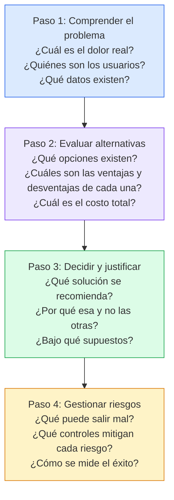
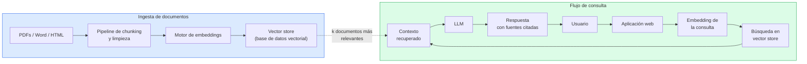
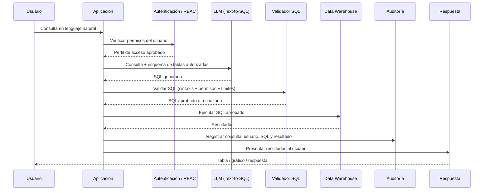
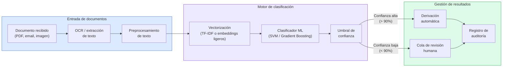
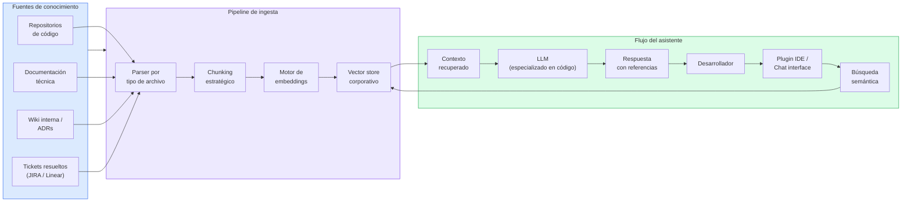
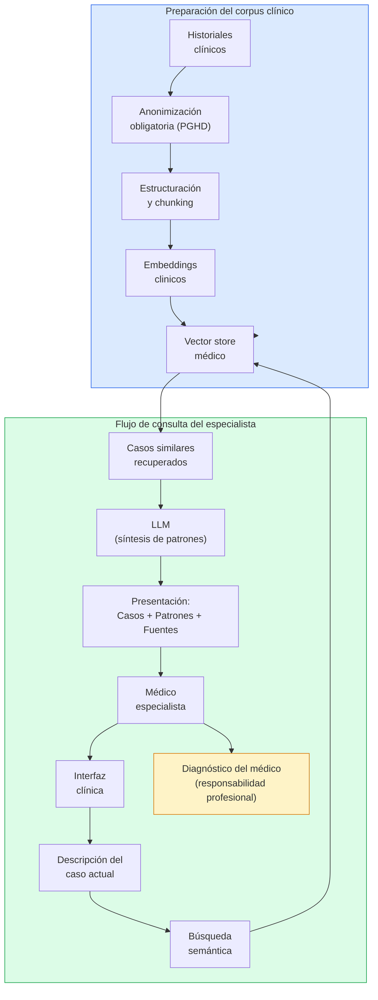
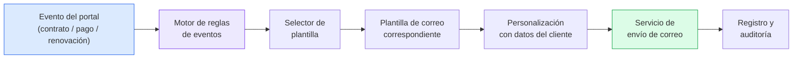
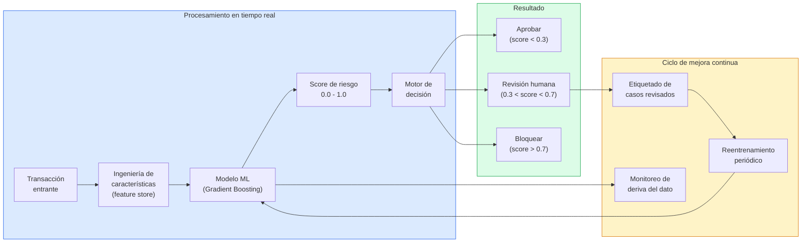
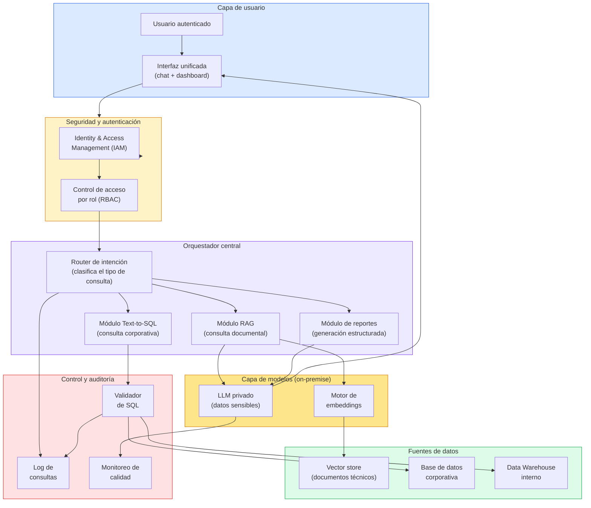

# Ingeniería de IA desde los Fundamentos

# Módulo I — Los Fundamentos de la Inteligencia Artificial

# Capítulo 14 — Casos de Estudio: De los Conceptos a las Decisiones Reales

**Versión:** 0.5 (Revisión conceptual)

---

## 1. Objetivos de aprendizaje

Al finalizar este capítulo serás capaz de:

1. Aplicar los conceptos estudiados en el Módulo I a problemas reales y concretos de organizaciones.
2. Justificar técnicamente la elección de una solución basada en Inteligencia Artificial (IA), en Machine Learning (ML) clásico o en automatización tradicional.
3. Identificar cuándo un sistema de Generación Aumentada por Recuperación (RAG, por sus siglas en inglés de *Retrieval-Augmented Generation*) representa mejor alternativa que un buscador tradicional o que el entrenamiento de un modelo propio.
4. Reconocer los riesgos específicos de cada arquitectura y proponer controles concretos.
5. Diseñar una arquitectura conceptual completa para un problema integrador que involucra múltiples fuentes de información, privacidad y acceso en lenguaje natural.
6. Distinguir cuándo un Large Language Model (LLM) aporta valor diferencial y cuándo una solución más simple es la decisión correcta.
7. Analizar casos reales utilizando una metodología estructurada de cuatro pasos.

---

## 2. Introducción

Hasta este punto hemos construido un mapa conceptual del ecosistema de la IA: qué es, cómo aprenden los modelos, cómo procesan el lenguaje, qué limitaciones tienen y qué riesgos presentan. Ese mapa es valioso. Pero un mapa solo tiene utilidad cuando sabemos leerlo para tomar decisiones en el terreno.

Este capítulo es el terreno.

En los capítulos anteriores respondimos preguntas del tipo "¿qué es un embedding?" o "¿cómo funciona un Transformer?". Aquí las preguntas son diferentes: "¿debería mi empresa implementar un RAG o un buscador tradicional?", "¿conviene entrenar un modelo propio o usar uno existente?", "¿qué pasa si el modelo genera SQL incorrecto sobre nuestra base de datos de producción?".

Esas preguntas no tienen una respuesta universal. Tienen una metodología para encontrar la respuesta correcta en cada contexto. Y eso es exactamente lo que este capítulo desarrolla.

Analizaremos siete casos representativos de situaciones que un profesional puede encontrar en organizaciones reales. Cada caso incluye el contexto, las alternativas evaluadas con sus ventajas y desventajas, la decisión recomendada con su justificación, los riesgos identificados y los controles propuestos. Al final, enfrentaremos un caso integrador que requiere diseñar una arquitectura completa.

---

## 3. Metodología de análisis de casos

Antes de revisar los casos, es útil tener una metodología explícita. Cuando un profesional recibe un requerimiento de IA, la tentación es ir directamente a la solución técnica. Ese es el primer error.

La metodología que aplicaremos en cada caso sigue cuatro pasos:

Esta metodología no es burocrática. Es la diferencia entre una decisión justificada y una decisión caprichosa. En entornos organizacionales, donde las inversiones en IA pueden ser significativas, la justificación técnica es tan importante como la solución misma.

---

## 4. Analogía: la sala de diagnóstico

Analizar un caso de IA se parece al trabajo de una sala de diagnóstico técnico. Un buen equipo no mira una única señal y decide una intervención costosa. Revisa síntomas, historial, restricciones, riesgos y alternativas. A veces la intervención correcta es compleja. Otras veces es ajustar una configuración, ordenar un proceso o eliminar una causa simple.

La IA debe evaluarse con la misma disciplina. Un requerimiento como "queremos un chatbot" es un síntoma, no un diagnóstico. Puede esconder un problema de documentación, de permisos, de experiencia de usuario, de integración entre sistemas o de capacitación interna. La tarea del arquitecto es descubrir qué problema real hay debajo y recién entonces decidir si la IA corresponde.

---

## 5. Caso 1 — Chatbot para documentación interna

### 4.1 Contexto

Una empresa de servicios financieros con 800 empleados ha acumulado durante ocho años más de 12.000 documentos técnicos: manuales de procedimientos, políticas regulatorias, guías de productos, instructivos de sistemas internos y actas de capacitación. Los documentos están distribuidos en tres repositorios distintos y en formatos heterogéneos (PDF, Word, HTML interno).

El problema concreto: los empleados del área de atención al cliente pierden en promedio 35 minutos por turno buscando información para responder consultas. Cuando no la encuentran, escalan al área técnica, generando una demanda adicional que el equipo técnico no puede absorber eficientemente.

### 4.2 Alternativas evaluadas

**Opción A — Buscador tradicional por palabras clave**

| Ventajas | Desventajas |
|---|---|
| Implementación relativamente simple | Requiere que el usuario conozca los términos exactos |
| Bajo costo de operación | No comprende consultas en lenguaje natural |
| Alta predictibilidad de resultados | Devuelve documentos completos, no respuestas puntuales |
| Sin dependencia de servicios externos | Baja adopción cuando las consultas son ambiguas |

**Opción B — Sistema RAG con LLM**

| Ventajas | Desventajas |
|---|---|
| Responde en lenguaje natural | Requiere infraestructura de embeddings y vector store |
| Extrae fragmentos relevantes de múltiples documentos | Costo de operación mayor (llamadas a API de LLM) |
| No requiere reentrenamiento al actualizar documentos | Puede generar respuestas incorrectas si el contexto es insuficiente |
| Alta adopción por la UX conversacional | Requiere monitoreo continuo de calidad de respuestas |

**Opción C — Entrenar un modelo propio**

| Ventajas | Desventajas |
|---|---|
| Control total sobre el modelo | Costo altísimo de entrenamiento y mantenimiento |
| Sin dependencia de proveedores externos | Requiere equipo especializado de ML |
| Potencialmente mayor privacidad | El modelo queda desactualizado cuando cambian los documentos |
| | Tiempo de implementación de meses a años |

### 4.3 Decisión recomendada

**Opción B: Sistema RAG.** Es el mejor equilibrio entre costo de implementación, calidad de respuesta y facilidad de mantenimiento. El diferenciador clave frente al buscador tradicional es que el sistema puede responder consultas como "¿qué debo hacer si un cliente solicita la baja de su cuenta pero tiene deuda pendiente?" extrayendo fragmentos de tres documentos distintos y sintetizando una respuesta coherente. Eso no lo puede hacer ningún buscador por palabras clave.

La Opción C queda descartada no por razones técnicas sino por razones económicas y operativas: la empresa no tiene el equipo ni el presupuesto para mantener un modelo propio, y el ciclo de actualización de documentos invalidaría constantemente el entrenamiento.

### 4.4 Arquitectura propuesta

### 4.5 Riesgos identificados y controles

| Riesgo | Probabilidad | Impacto | Control propuesto |
|---|---|---|---|
| El LLM genera una respuesta incorrecta o incompleta | Media | Alto | Citar siempre el documento fuente; el usuario puede verificar |
| Documentos desactualizados en el vector store | Alta | Medio | Pipeline de reingestión automática al detectar cambios |
| Exposición de documentos confidenciales a usuarios no autorizados | Media | Alto | Control de acceso por permisos antes del vector store |
| Costo excesivo de llamadas a la API del LLM | Baja | Medio | Caché de respuestas para consultas frecuentes |

### 4.6 Métricas de éxito

- Reducción del tiempo promedio de búsqueda de 35 a menos de 5 minutos.
- Tasa de escalamiento al área técnica reducida en al menos 40%.
- Satisfacción del usuario con las respuestas: al menos 80% de calificaciones positivas en encuesta interna.
- Precisión de recuperación (respuestas con fuente correcta): superior al 90% en auditoría mensual.

---

## 6. Caso 2 — Consulta a Data Warehouse en lenguaje natural

### 5.1 Contexto

Una empresa de retail con presencia en seis países opera un Data Warehouse (DW) que consolida información de ventas, inventario, clientes y logística. El equipo de datos recibe diariamente entre 80 y 120 solicitudes de reportes de distintas áreas: gerencia, marketing, supply chain y finanzas. Cada solicitud requiere que un analista escriba la consulta SQL correspondiente, lo que genera un cuello de botella de 48 a 72 horas de demora.

La propuesta: permitir que los usuarios realicen consultas en lenguaje natural que el sistema transforme automáticamente en SQL, ejecute contra la base de datos y devuelva los resultados.

### 5.2 Alternativas evaluadas

**Opción A — Text-to-SQL con LLM**

| Ventajas | Desventajas |
|---|---|
| El usuario escribe en lenguaje natural sin saber SQL | El LLM puede generar SQL semánticamente incorrecto |
| Reducción drástica del cuello de botella | Riesgo de consultas que exponen información sensible |
| Acceso democratizado a los datos | Consultas costosas o que bloquean el DW si no se validan |
| | Requiere que el LLM conozca el esquema de la base de datos |

**Opción B — Generador de reportes con interfaz visual (BI tradicional)**

| Ventajas | Desventajas |
|---|---|
| Alta predictibilidad y seguridad | El usuario sigue dependiendo de analistas para reportes complejos |
| Sin riesgo de consultas incorrectas | No responde consultas ad hoc no previstas |
| Fácil gobierno y auditoría | Menor democratización del acceso a datos |

### 5.3 Decisión recomendada

**Opción A con controles robustos.** La democratización del acceso a datos es un objetivo estratégico válido. El texto-a-SQL con LLM puede cumplirlo, pero solo si se diseña con un esquema de seguridad y validación que lo haga viable en producción. Sin esos controles, la opción se convierte en un riesgo operativo y de privacidad.

### 5.4 Arquitectura propuesta

### 5.5 Riesgos identificados y controles

| Riesgo | Probabilidad | Impacto | Control propuesto |
|---|---|---|---|
| SQL generado semánticamente incorrecto | Alta | Alto | Mostrar SQL al usuario antes de ejecutar; requiere confirmación |
| Acceso a datos de otro perfil de usuario | Baja | Crítico | RBAC: el LLM solo recibe el esquema de tablas autorizadas por el perfil |
| Consulta que bloquea o satura el DW | Media | Alto | Límite de filas devueltas; timeout de ejecución; query budget por usuario |
| Exfiltración de datos sensibles | Baja | Crítico | Log de auditoría completo; alertas ante consultas masivas |
| El LLM produce SQL que siempre parece correcto pero es erróneo | Media | Alto | Validación por analista de muestra semanal; métricas de calidad de resultados |

### 5.6 Métricas de éxito

- Tiempo de respuesta para consultas ad hoc: de 48-72 horas a menos de 5 minutos.
- Porcentaje de consultas aprobadas automáticamente sin intervención de analista: objetivo inicial del 60%.
- Tasa de error en SQL generado (consultas que devuelven resultado incorrecto detectado en revisión): inferior al 5%.
- Cero incidentes de acceso no autorizado a datos en los primeros seis meses.

---

## 7. Caso 3 — Clasificación automática de documentos

### 6.1 Contexto

Una aseguradora recibe diariamente entre 3.000 y 5.000 documentos por múltiples canales: correo electrónico, portal web, fax digitalizado y carga manual. Cada documento debe ser clasificado en una de 18 categorías (siniestros, altas de pólizas, modificaciones, reclamos, documentación obligatoria, etc.) y derivado al área correspondiente. El proceso manual involucra a un equipo de 12 personas y genera demoras de hasta 4 horas en la clasificación.

### 6.2 Alternativas evaluadas

**Opción A — Reglas manuales**

| Ventajas | Desventajas |
|---|---|
| Totalmente predecible y explicable | No escala bien cuando los documentos son heterogéneos |
| Sin costo de modelos ni infraestructura de IA | El equipo de reglas crece con cada caso borde |
| Fácil de auditar | Mantenimiento costoso en el tiempo |

**Opción B — Modelo de clasificación con Machine Learning clásico**

| Ventajas | Desventajas |
|---|---|
| Alta precisión en categorías con muchos ejemplos | Requiere datos etiquetados por categoría |
| Bajo costo de inferencia | Menor flexibilidad ante categorías nuevas |
| Rápido de entrenar y actualizar | Sensible al desbalance de clases |
| Explicable con técnicas estándar | |

**Opción C — LLM para clasificación zero-shot**

| Ventajas | Desventajas |
|---|---|
| No requiere datos etiquetados previos | Costo por llamada a API muy superior al ML clásico |
| Alta flexibilidad ante nuevas categorías | Latencia mayor, inadecuada para volúmenes altos |
| Puede manejar documentos muy heterogéneos | Resultados inconsistentes sin fine-tuning |
| | Innecesariamente costoso para un problema bien definido |

### 6.3 Decisión recomendada

**Opción B: Modelo de ML clásico.** Este es uno de los casos más ilustrativos del módulo: el LLM no siempre es la mejor solución. Un clasificador de texto entrenado con datos históricos etiquetados (que la aseguradora tiene en abundancia) alcanzará precisiones del 92-96% en categorías bien representadas, con un costo de inferencia de milisegundos por documento y sin dependencia de proveedores externos de LLM.

La Opción C se justificaría solo si las categorías cambian frecuentemente o si los documentos son tan heterogéneos que el ML clásico no logra representaciones útiles. En este caso, las 18 categorías son estables y los datos históricos son abundantes.

### 6.4 Arquitectura propuesta

### 6.5 Riesgos identificados y controles

| Riesgo | Probabilidad | Impacto | Control propuesto |
|---|---|---|---|
| Clasificación incorrecta en documentos de baja calidad (escaneados, texto ilegible) | Alta | Medio | Umbral de confianza: documentos bajo 90% van a cola humana |
| Categoría nueva no presente en entrenamiento | Media | Medio | Proceso de reentrenamiento trimestral; alerta ante categorías desconocidas |
| Desbalance de clases afecta categorías minoritarias | Media | Alto | Técnicas de oversampling (SMOTE) y peso de clase en entrenamiento |
| Deriva del dato por cambios regulatorios | Baja | Alto | Monitoreo mensual de precisión por categoría; pipeline de reentrenamiento |

### 6.6 Métricas de éxito

- Precisión global de clasificación: superior al 92% en producción.
- Porcentaje de documentos clasificados automáticamente sin intervención humana: objetivo del 85%.
- Tiempo promedio de clasificación: de 4 horas a menos de 30 segundos.
- Reducción de equipo de clasificación manual: reasignación parcial (no reemplazo) a tareas de supervisión y casos complejos.

---

## 8. Caso 4 — Asistente de código para desarrolladores

### 7.1 Contexto

Un equipo de desarrollo de 40 ingenieros trabaja sobre una plataforma de software empresarial con más de 800.000 líneas de código en múltiples repositorios. Los ingenieros nuevos tardan entre tres y seis meses en ser productivos por la complejidad de entender la arquitectura, las convenciones internas y las dependencias entre módulos. Los desarrolladores senior pierden tiempo significativo respondiendo preguntas de contexto que podrían resolverse con acceso eficiente a la documentación técnica interna.

### 7.2 Alternativas evaluadas

**Opción A — LLM público sin contexto del proyecto**

| Ventajas | Desventajas |
|---|---|
| Sin implementación, accesible inmediatamente | No conoce el código ni las convenciones internas |
| Alta calidad de generación de código genérico | Respuestas genéricas no aplicables al proyecto específico |
| Sin costos de infraestructura propia | Riesgo de enviar código propietario a proveedores externos |

**Opción B — RAG con documentación y código del proyecto + LLM**

| Ventajas | Desventajas |
|---|---|
| El asistente tiene contexto real del proyecto | Requiere implementación de pipeline de ingesta de código y docs |
| Puede responder preguntas específicas del repositorio | Mantenimiento del índice cuando el código cambia |
| Reduce tiempo de onboarding | Complejidad de indexar código de forma útil |
| El código propietario no sale de la infraestructura propia | Requiere LLM con buena capacidad de razonamiento sobre código |

**Opción C — Modelo local especializado en código**

| Ventajas | Desventajas |
|---|---|
| Privacidad total, sin envío de datos a externos | Costo de infraestructura de GPU para inferencia local |
| Sin costos de API | Calidad inferior a los modelos de mayor tamaño en la nube |
| | No tiene contexto del proyecto sin un RAG adicional |

### 7.3 Decisión recomendada

**Opción B: RAG con documentación y código del proyecto + LLM.** El valor de un asistente de desarrollo no reside en el modelo aislado, sino en la arquitectura completa. Un LLM genérico sin contexto del proyecto produce respuestas genéricas. Un LLM con acceso al código real, la documentación interna, las convenciones del equipo y los tickets de trabajo resueltos produce respuestas aplicables directamente. Esa diferencia define el retorno de la inversión.

### 7.4 Arquitectura propuesta

### 7.5 Riesgos identificados y controles

| Riesgo | Probabilidad | Impacto | Control propuesto |
|---|---|---|---|
| El asistente genera código con vulnerabilidades de seguridad | Media | Alto | Revisión obligatoria de código generado; integración con SAST |
| El índice queda desactualizado respecto al código real | Alta | Medio | Trigger de reingesta automática en cada merge a rama principal |
| El desarrollador adopta respuestas incorrectas sin verificar | Media | Alto | El asistente cita siempre el fragmento fuente; cultura de verificación |
| Filtración de código propietario si se usa LLM externo | Media | Crítico | Optar por LLM on-premise para repositorios más sensibles |

### 7.6 Métricas de éxito

- Reducción del tiempo de onboarding de nuevos desarrolladores: de 3-6 meses a menos de 6 semanas.
- Porcentaje de preguntas técnicas respondidas sin escalar a un senior: objetivo del 70%.
- Satisfacción del equipo de desarrollo con el asistente: al menos 75% de uso activo semanal.
- Tiempo ahorrado por desarrollador senior en responder preguntas de contexto: estimación mínima de 3 horas semanales.

---

## 9. Caso 5 — Diagnóstico asistido en contexto clínico

### 8.1 Contexto

Una red de clínicas privadas gestiona un repositorio de 180.000 historiales clínicos digitalizados de los últimos 12 años. Los médicos especialistas, al atender un caso nuevo, frecuentemente necesitan comparar la presentación del paciente con casos similares documentados para fundamentar su diagnóstico diferencial. Ese proceso hoy se realiza de forma manual e irregular: algunos médicos consultan colegas, otros revisan literatura; pocos tienen acceso eficiente a los historiales propios de la institución.

### 8.2 Alternativas evaluadas

**Opción A — Búsqueda por palabras clave sobre historiales**

| Ventajas | Desventajas |
|---|---|
| Simple de implementar | No captura similitud semántica entre síntomas |
| Bajo costo | El médico debe conocer la terminología exacta |
| Alta predictibilidad | Devuelve documentos completos, no casos relevantes |

**Opción B — Búsqueda semántica con embeddings + LLM para síntesis**

| Ventajas | Desventajas |
|---|---|
| Recupera casos similares aunque usen terminología diferente | Requiere anonimización rigurosa antes de indexar |
| El LLM puede sintetizar patrones entre casos recuperados | El LLM puede generar inferencias incorrectas sobre datos médicos |
| Potencia la experiencia del especialista, no la reemplaza | Requiere validación clínica continua del sistema |
| | Marco regulatorio estricto (privacidad de datos de salud) |

### 8.3 Decisión recomendada

**Opción B con un principio irrenunciable: el sistema asiste la decisión del especialista, no la reemplaza.** La arquitectura produce una lista de casos históricos similares con los fragmentos más relevantes. El LLM puede sintetizar patrones entre esos casos. Pero el diagnóstico es siempre responsabilidad del médico. El sistema no emite diagnósticos: emite información de contexto que el profesional evalúa con su criterio clínico.

Este punto no es opcional ni negociable. Cualquier sistema de IA en contextos de salud que presente sus resultados como diagnósticos —y no como información de soporte— introduce un riesgo médico y regulatorio inaceptable.

### 8.4 Arquitectura propuesta

### 8.5 Riesgos identificados y controles

| Riesgo | Probabilidad | Impacto | Control propuesto |
|---|---|---|---|
| El LLM sintetiza una inferencia clínica incorrecta | Media | Crítico | Presentar siempre los casos fuente; el LLM no emite diagnósticos |
| Violación de privacidad de datos de pacientes | Baja | Crítico | Anonimización completa antes de indexar; acceso solo desde red interna |
| El médico delega la decisión al sistema | Media | Crítico | Diseño de interfaz que presente el resultado como "contexto", no como "diagnóstico" |
| Datos desactualizados en el corpus | Media | Alto | Proceso de actualización periódica; versión del corpus visible al médico |

### 8.6 Métricas de éxito

- Porcentaje de médicos que consultan el sistema al menos una vez por semana: objetivo del 60% en los primeros seis meses.
- Calificación de utilidad del contexto provisto: al menos 75% de respuestas marcadas como "útil" o "muy útil".
- Cero incidentes de privacidad relacionados con el sistema.
- Tiempo de recuperación de casos similares: inferior a 10 segundos.

---

## 10. Caso 6 — Automatización de procesos: correos post-evento

### 9.1 Contexto

Una empresa de servicios profesionales quiere automatizar el envío de correos electrónicos de seguimiento cuando un cliente completa determinadas acciones en su portal: registrar un nuevo contrato, solicitar una renovación, realizar un pago o actualizar sus datos. El equipo propone "usar IA" para gestionar este proceso.

### 9.2 Análisis

Esta es la pregunta central del caso: **¿requiere realmente IA?**

Analicemos el flujo:

1. El cliente realiza una acción en el portal.
2. El sistema detecta ese evento.
3. Se selecciona la plantilla de correo correspondiente al tipo de evento.
4. Se personalizan los campos con los datos del cliente.
5. Se envía el correo.

Ninguno de estos pasos requiere inteligencia artificial. El flujo es determinista, predecible y puede modelarse completamente con reglas explícitas. Un sistema de automatización de workflows (Zapier, n8n, o un proceso interno basado en eventos) resuelve este problema con mayor eficiencia, menor costo y mayor predictibilidad que un sistema de IA.

### 9.3 Decisión recomendada

**Automatización tradicional basada en eventos. No utilizar IA.**

Este caso ilustra uno de los principios más importantes de este módulo: **el hecho de que la IA sea capaz de hacer algo no significa que sea la herramienta correcta para hacerlo**. Añadir un LLM a este flujo agregaría latencia, costo, impredecibilidad y riesgo de variabilidad en los mensajes, sin aportar ningún beneficio real.

La IA agrega valor cuando el problema tiene variabilidad que no puede capturarse con reglas, cuando requiere procesamiento de lenguaje natural no estructurado o cuando la escala del problema hace imposible la solución manual. Ninguna de esas condiciones aplica aquí.

### 9.4 Cuándo sí tendría sentido usar IA en este proceso

Podría justificarse el uso de IA si:

- Los correos debieran personalizarse profundamente basándose en el historial conversacional del cliente (no solo en su nombre).
- El contenido del correo requiriera generación dinámica compleja basada en múltiples señales no estructuradas.
- La empresa necesitara segmentar y adaptar el tono del mensaje basándose en el análisis de sentimiento de interacciones previas.

Ninguno de esos escenarios aplica al problema original.

### 9.5 Arquitectura propuesta

### 9.6 Métricas de éxito

- Porcentaje de eventos que generan un correo automático dentro de los 5 minutos: objetivo del 99,9%.
- Tasa de error en envíos (correo enviado a destinatario incorrecto o con datos erróneos): inferior al 0,1%.
- Costo por evento procesado: inferior a los modelos alternativos con IA.

---

## 11. Caso 7 — Detección de fraude en tiempo real

### 10.1 Contexto

Una fintech que procesa 2 millones de transacciones diarias necesita detectar transacciones fraudulentas en tiempo real, con una latencia máxima de decisión de 200 milisegundos por transacción. El equipo de riesgo tiene acceso a 18 meses de historial de transacciones etiquetadas (fraudulentas y legítimas) con 42 variables estructuradas por transacción: monto, país de origen, dispositivo, hora, frecuencia reciente, distancia entre transacciones consecutivas, etc.

El equipo de tecnología propone dos enfoques alternativos.

### 10.2 Alternativas evaluadas

**Opción A — Modelo de ML clásico (Gradient Boosting / Random Forest)**

| Ventajas | Desventajas |
|---|---|
| Latencia de inferencia: 1-5 ms (vs 200 ms requerido) | Menos flexible para patrones emergentes sin reentrenamiento |
| Alta interpretabilidad: importancia de variables explícita | Requiere ingeniería de características cuidadosa |
| Costo de inferencia muy bajo a escala de millones de transacciones | |
| Maduro en producción: pipelines MLOps bien establecidos | |
| Excelente desempeño en datos tabulares estructurados | |

**Opción B — LLM para análisis de patrones de fraude**

| Ventajas | Desventajas |
|---|---|
| Puede analizar descripciones textuales no estructuradas | Latencia de 500-3.000 ms: incompatible con el requisito de 200 ms |
| Alta flexibilidad ante patrones nuevos | Costo de inferencia 100-1.000x mayor a escala |
| | No tiene ventaja sobre ML clásico con datos tabulares estructurados |
| | Caja negra: dificulta la explicación de decisiones ante reguladores |

### 10.3 Decisión recomendada

**Opción A: Modelo de ML clásico.** La latencia y el costo son restricciones no negociables. Un LLM con latencia de segundos en un sistema que debe decidir en 200 milisegundos no es una opción: es un bloqueador arquitectónico. Además, para datos tabulares estructurados con variables bien definidas, los modelos de Gradient Boosting tienen décadas de evidencia de desempeño superior a cualquier alternativa basada en LLM.

Este caso ilustra que la elección tecnológica no es solo técnica: el requisito de latencia, el tipo de dato (tabular vs no estructurado) y las exigencias regulatorias de explicabilidad son factores de arquitectura que determinan la solución antes de que el modelo entre en consideración.

### 10.4 Arquitectura propuesta

### 10.5 Riesgos identificados y controles

| Riesgo | Probabilidad | Impacto | Control propuesto |
|---|---|---|---|
| Alta tasa de falsos positivos (bloquea transacciones legítimas) | Media | Alto | Ajustar umbral de decisión; proceso de apelación rápido para el cliente |
| El modelo no detecta patrones de fraude nuevos (evasión) | Alta | Alto | Monitoreo de métricas por segmento; reentrenamiento frecuente |
| Deriva del dato por cambios en comportamiento de usuarios | Media | Alto | Feature drift monitoring en producción |
| Explicación de decisión ante reclamación del cliente | Media | Alto | Registro de las variables más influyentes en cada decisión (SHAP values) |

### 10.6 Métricas de éxito

- Precisión de detección de fraude (recall sobre fraudes reales): superior al 94%.
- Tasa de falsos positivos (transacciones legítimas bloqueadas): inferior al 0,5%.
- Latencia de decisión p99: inferior a 50 ms.
- Pérdida económica por fraude no detectado: reducción del 60% respecto a la línea base manual.

---

## 12. Caso integrador — Arquitectura corporativa unificada

### 11.1 Contexto del desafío

Una empresa de ingeniería con 1.200 empleados y presencia en cuatro países enfrenta simultáneamente los siguientes desafíos de información:

- Posee 45.000 documentos técnicos (normas, planos, procedimientos, manuales de equipos) dispersos en tres sistemas de gestión documental distintos.
- Opera una base de datos corporativa con información de proyectos, presupuestos, clientes y proveedores.
- Los proyectos generan reportes mensuales que requieren consolidar datos de múltiples fuentes.
- La gerencia quiere poder consultar indicadores clave de negocio en lenguaje natural.
- Existe una restricción de privacidad: la información de proyectos no puede salir de la infraestructura corporativa.

La empresa quiere saber si puede construir **una plataforma unificada** que resuelva todos estos casos con una arquitectura coherente.

### 11.2 Análisis arquitectónico

El desafío integrador combina cuatro capacidades que hemos visto en los casos anteriores:
1. RAG sobre documentación técnica (Caso 1).
2. Text-to-SQL sobre base de datos corporativa (Caso 2).
3. Generación de reportes estructurados.
4. Privacidad total de datos (todos los datos deben permanecer en infraestructura propia).

La restricción de privacidad es determinante: **no se puede usar un LLM como servicio externo** para los datos más sensibles. Esto implica una arquitectura híbrida con un LLM desplegado on-premise.

### 11.3 Arquitectura propuesta

### 11.4 Decisiones arquitectónicas clave

**LLM on-premise.** Dada la restricción de privacidad, se despliega un LLM de código abierto en la infraestructura corporativa. Los modelos disponibles (familia Llama, Mistral, entre otros) alcanzan calidad suficiente para los casos de uso descritos sin necesidad de enviar datos al exterior.

**Router de intención.** Un componente liviano clasifica cada consulta del usuario en uno de tres tipos: documental (activa el módulo RAG), corporativa (activa el módulo Text-to-SQL) o de reporte (activa el módulo de generación). Este router puede ser un clasificador de ML simple o un LLM pequeño. No requiere el modelo más potente.

**Validador de SQL.** Antes de ejecutar cualquier consulta sobre la base de datos corporativa, un validador verifica que la consulta corresponde a las tablas autorizadas para el perfil del usuario. Ninguna consulta llega a la base de datos sin pasar por este control.

**Capa única de IAM/RBAC.** Un único punto de control de acceso antes del orquestador garantiza que los módulos individuales no necesiten implementar seguridad propia.

### 11.5 Riesgos y controles del caso integrador

| Riesgo | Control |
|---|---|
| El router clasifica incorrectamente la intención | Logging de clasificaciones; retroalimentación del usuario para corrección |
| El LLM on-premise tiene menor calidad que servicios externos | Evaluación periódica de calidad; posibilidad de actualizar el modelo |
| La complejidad de la arquitectura dificulta el mantenimiento | Documentación de cada módulo; interfaces bien definidas entre componentes |
| Un módulo compromete la seguridad de los datos | Aislamiento de módulos; auditoría centralizada; tests de penetración periódicos |

---

## 13. Conversación con un arquitecto

**Gerente de Proyectos:** Revisamos estos casos y tenemos una duda: ¿cómo sabemos cuándo conviene un RAG y cuándo conviene Text-to-SQL?

**Arquitecto:** La pregunta correcta no es RAG vs Text-to-SQL. La pregunta es: ¿cuál es la naturaleza de la información que el usuario necesita? Si la información está en documentos en lenguaje natural —procedimientos, manuales, políticas— la respuesta es un fragmento de texto relevante. Eso es lo que hace RAG: recuperar ese fragmento y sintetizarlo. Si la información está en una base de datos estructurada con filas y columnas —ventas, inventario, presupuestos— la respuesta es un número o una tabla. Eso es lo que hace Text-to-SQL.

**Gerente:** ¿Y si necesitamos ambas cosas en la misma consulta?

**Arquitecto:** Eso requiere un orquestador que sepa cuándo llamar a cada módulo. Es la arquitectura que vimos en el caso integrador. No es trivial de implementar, pero tampoco es imposible. La clave es separar bien las responsabilidades: el RAG no debería tocar la base de datos, y el Text-to-SQL no debería intentar resumir documentos. Cuando cada módulo hace lo suyo y el orquestador los coordina, el sistema es mantenible.

**Líder Técnico:** ¿Cómo lidiamos con las alucinaciones en estos contextos?

**Arquitecto:** Hay tres estrategias que se complementan. La primera es arquitectónica: citar siempre la fuente. Si el sistema muestra el fragmento del documento o el SQL que generó, el usuario puede verificar. La segunda es de diseño de prompts: instruir al modelo para que responda "no sé" cuando no tiene contexto suficiente en lugar de inventar. La tercera es de proceso: auditoría periódica de una muestra de respuestas. Ninguna de las tres elimina las alucinaciones completamente, pero las tres juntas las hacen manejables.

**Gerente:** ¿Cuándo se justifica invertir en un LLM on-premise versus usar un servicio externo?

**Arquitecto:** La decisión tiene tres variables: privacidad, costo y calidad. Si los datos son confidenciales y no pueden salir de la organización, el LLM on-premise no es opcional. Si el volumen de consultas es alto y el costo de la API externa escala de forma prohibitiva, el modelo propio puede amortizarse. Si ninguna de esas restricciones aplica, los servicios externos son generalmente la opción más eficiente porque la calidad de los modelos es superior y el mantenimiento es del proveedor. La respuesta correcta depende del contexto específico de la organización.

---

## 14. Errores frecuentes al analizar casos de IA

### Error 1: Empezar por el modelo, no por el problema

El error más común es que el equipo decide qué tecnología usar antes de entender el problema. "Vamos a hacer un RAG" o "vamos a usar un LLM" sin haber respondido primero "¿cuál es el problema concreto que queremos resolver y cuáles son sus restricciones?". La tecnología debe derivar del problema, no al revés.

### Error 2: Subestimar la complejidad de la ingesta de datos

La solución técnica (el modelo, la arquitectura) suele tomar el 20% del tiempo de implementación. La preparación de datos —limpieza, estructuración, anonimización, chunking, etiquetado— suele tomar el 80%. Los proyectos que no contemplan esto desde el inicio se retrasan o fracasan por problemas de datos, no por problemas tecnológicos.

### Error 3: Ignorar las restricciones no funcionales

Latencia, costo de operación, privacidad, disponibilidad y explicabilidad son restricciones que determinan la arquitectura tanto o más que los requisitos funcionales. Un sistema que funciona correctamente pero que cuesta 10 veces más de lo presupuestado o que viola regulaciones de privacidad es un fracaso, aunque el modelo sea técnicamente brillante.

### Error 4: No definir qué es el éxito

"El sistema funciona bien" no es una métrica. Si no se define antes del despliegue qué porcentaje de precisión es aceptable, qué tiempo de respuesta es tolerable y qué tasa de error es el límite, es imposible saber si el sistema cumplió su objetivo. Las métricas de éxito deben definirse en el diseño, no en la evaluación.

### Error 5: Asumir que el LLM siempre es la mejor solución

Los casos 3, 6 y 7 de este capítulo ilustran situaciones donde el LLM no es la opción correcta. Un modelo de ML clásico para clasificar documentos con categorías estables, un flujo determinista para enviar correos automáticos y un Gradient Boosting para detectar fraude en tiempo real son todas soluciones superiores a un LLM en sus respectivos contextos. La sofisticación tecnológica no es un criterio de calidad.

### Error 6: Diseñar sin controles de seguridad desde el inicio

La seguridad, el control de acceso y la auditoría no son características que se agregan al final. Deben estar en el diseño desde el primer día. Un sistema de Text-to-SQL sin RBAC, un RAG sin control de permisos por documento o un pipeline de ML sin logging no son prototipos: son riesgos operativos.

---

## 15. Buenas prácticas de toma de decisiones en arquitecturas de IA

### Práctica 1: Formular el problema antes de proponer la solución

Antes de cualquier conversación técnica, documenta: ¿cuál es el problema exacto? ¿Quiénes son los usuarios? ¿Qué datos están disponibles? ¿Cuáles son las restricciones no negociables (latencia, privacidad, costo)? ¿Cómo se medirá el éxito?

### Práctica 2: Evaluar siempre la alternativa más simple primero

Para cada problema, pregunta: ¿se puede resolver esto con reglas? ¿Con ML clásico? ¿Con automatización tradicional? Si la respuesta es sí, esa es probablemente la solución correcta. Solo se justifica agregar complejidad cuando la solución simple no puede resolver el problema.

### Práctica 3: Separar el prototipo del sistema de producción

Un prototipo que funciona en una demo no es un sistema de producción. La diferencia incluye: manejo de errores, monitoreo, escalabilidad, actualización del modelo, auditoría, seguridad y documentación. Nunca presentar un prototipo como si fuera una solución lista para desplegar.

### Práctica 4: Documentar las decisiones de diseño y sus justificaciones

Cada decisión arquitectónica relevante —por qué se eligió RAG sobre búsqueda tradicional, por qué se optó por ML clásico en lugar de LLM, por qué se despliega el modelo on-premise— debe estar documentada con su justificación. Los proyectos de IA tienen alta rotación de equipo y alta velocidad de cambio tecnológico. Sin documentación de decisiones, el sistema se convierte en una caja negra organizacional.

### Práctica 5: Diseñar el proceso de actualización del modelo desde el inicio

Todo modelo de IA se degrada con el tiempo a medida que el mundo cambia. El diseño debe incluir desde el primer día: cómo se detecta la degradación, qué datos se recolectan para el reentrenamiento, con qué frecuencia se actualiza el modelo y cómo se valida antes de volver a desplegarlo.

### Práctica 6: Involucrar a los usuarios finales en el diseño

Las personas que van a usar el sistema conocen el problema mejor que los arquitectos. Sus expectativas, su tolerancia al error, su flujo de trabajo real y sus limitaciones técnicas deben informar el diseño. Un sistema técnicamente correcto que no se adapta al flujo de trabajo real tiene una tasa de adopción cercana a cero.

---

## 16. Laboratorio estructurado: análisis de un caso propio

### Objetivo

Aplicar la metodología del capítulo a un caso real o plausible de una organización, comparando alternativas y justificando una decisión arquitectónica.

### Nivel

Intermedio.

### Tiempo estimado

90 a 120 minutos.

### Prerrequisitos

Haber leído los capítulos sobre LLMs, embeddings, Retrieval-Augmented Generation (RAG), riesgos y arquitectura conceptual.

### Herramientas

- Editor de texto.
- Hoja de cálculo o tabla Markdown.
- Opcional: herramienta compatible con Mermaid para diagramar.

### Escenario

Una organización solicita incorporar IA en un proceso existente. El pedido inicial es impreciso: "queremos automatizar consultas y reducir tiempos de respuesta". Tu tarea es convertir ese pedido en una recomendación técnica defendible.

### Desarrollo

**Paso 1 — Describir el caso**

Acción: escribí el contexto, usuarios, información disponible y dolor principal.

Motivo: sin contexto, cualquier solución parece razonable.

Resultado esperado: una descripción de 150 a 250 palabras.

**Paso 2 — Formular el problema**

Acción: redactá el problema sin mencionar tecnología.

Motivo: si el problema solo puede expresarse nombrando una herramienta, probablemente todavía no está entendido.

Resultado esperado: una frase verificable.

**Paso 3 — Comparar alternativas**

Acción: evaluá al menos tres opciones: solución sin IA, ML clásico y LLM/RAG.

Motivo: una decisión profesional necesita contraste.

Resultado esperado: tabla con ventajas, desventajas, riesgos y costo relativo.

**Paso 4 — Diseñar la arquitectura**

Acción: dibujá una arquitectura conceptual con componentes, flujos y controles.

Motivo: el diagrama muestra si la propuesta puede operar más allá de una demo.

Resultado esperado: diagrama Mermaid o descripción equivalente.

**Paso 5 — Definir riesgos y controles**

Acción: identificá al menos cinco riesgos y una mitigación para cada uno.

Motivo: en IA, el riesgo no se elimina con intención; se gestiona con diseño.

Resultado esperado: matriz de riesgos.

**Paso 6 — Recomendar**

Acción: redactá una recomendación final.

Motivo: el arquitecto debe poder decidir y comunicar.

Resultado esperado: recomendación de 200 a 300 palabras con supuestos y límites.

### Validación

El laboratorio está completo si:

- el problema está formulado antes que la solución;
- las alternativas están comparadas;
- la arquitectura incluye seguridad, validación y auditoría;
- los riesgos tienen controles concretos;
- la recomendación final es defendible ante un comité técnico.

### Desafíos opcionales

1. Agregá métricas de éxito para un piloto de 30 días.
2. Definí qué evidencia pedirías antes de aprobar producción.
3. Rediseñá la solución suponiendo restricciones fuertes de privacidad.

---

## 17. Preguntas de reflexión

1. ¿Qué caso del capítulo muestra con más claridad que no siempre conviene usar un LLM?
2. ¿Qué diferencia hay entre una arquitectura atractiva para una demo y una arquitectura lista para producción?
3. ¿Qué controles aparecen repetidamente en distintos casos?
4. ¿Qué decisión cambiaría si los datos fueran altamente sensibles?
5. ¿Qué caso requiere más participación humana y por qué?
6. ¿Cómo explicarías a un directivo que una solución más simple puede ser mejor?

---

## 18. Glosario breve

**Arquitectura conceptual:** descripción de componentes, responsabilidades y flujos sin depender todavía de tecnologías específicas.

**Control:** mecanismo técnico u operativo que reduce un riesgo identificado.

**Métrica de éxito:** indicador observable que permite evaluar si la solución cumple su objetivo.

**Piloto:** implementación acotada para validar hipótesis de valor y riesgo antes de producción.

**Restricción:** condición que limita el diseño, como costo, latencia, privacidad, disponibilidad o regulación.

---

## 19. Resumen narrativo

Los siete casos de este capítulo tienen un denominador común: la tecnología correcta es la que resuelve el problema del usuario dentro de las restricciones del contexto. No existe una respuesta universal, pero sí existe una metodología: comprender el problema antes de proponer la solución, evaluar múltiples alternativas con honestidad sobre sus ventajas y desventajas, y gestionar los riesgos desde el diseño.

El caso integrador mostró que los problemas complejos no requieren tecnologías exóticas: requieren arquitecturas bien diseñadas que combinan componentes conocidos de forma coherente. Un router de intención, un módulo RAG, un módulo Text-to-SQL y una capa de seguridad transversal son suficientes para construir una plataforma corporativa de consulta de información. La clave no está en cada componente individual: está en cómo se integran y en que cada uno hace exactamente lo que le corresponde.

La IA es una herramienta poderosa cuando se aplica al problema correcto con el diseño correcto. Es una fuente de complejidad innecesaria cuando se aplica a problemas que soluciones más simples pueden resolver mejor.

Un arquitecto no elige la tecnología más impresionante. Elige la que resuelve el problema con el menor riesgo y la mayor sostenibilidad a largo plazo.

---

## 20. Checklist del capítulo

- [ ] Puedo describir la metodología de cuatro pasos para analizar un caso de IA sin recurrir a un modelo de referencia.
- [ ] Puedo justificar por qué un sistema RAG es preferible al entrenamiento de un modelo propio para documentación interna.
- [ ] Puedo identificar al menos tres controles de seguridad obligatorios en una arquitectura Text-to-SQL.
- [ ] Puedo explicar por qué un clasificador de ML clásico puede ser mejor que un LLM para clasificación de documentos en un contexto específico.
- [ ] Puedo describir la diferencia arquitectónica entre un sistema de diagnóstico asistido y un sistema de diagnóstico automatizado.
- [ ] Puedo identificar al menos un escenario donde la respuesta correcta es "no usar IA".
- [ ] Puedo explicar por qué la latencia de inferencia descarta el uso de LLM en detección de fraude en tiempo real.
- [ ] Puedo describir los componentes principales de la arquitectura corporativa unificada del caso integrador.
- [ ] Puedo enunciar al menos cuatro errores frecuentes al analizar casos de IA.
- [ ] Completé el análisis del caso profesional propio con los ocho pasos de la metodología.

---

## 21. Próximo capítulo

**Capítulo 15 — Evaluación Final del Módulo I**

Llegamos al punto de cierre del primer módulo. El capítulo 15 no es un repaso: es una evaluación de criterio. Verificaremos si desarrollaste la capacidad de justificar decisiones técnicas, de analizar afirmaciones con pensamiento crítico y de diseñar una arquitectura completa para un problema real. El objetivo no es que recuerdes definiciones. El objetivo es que puedas pensar como un arquitecto de IA.

---

> "Un arquitecto no memoriza respuestas. Comprende problemas para poder diseñar soluciones."
