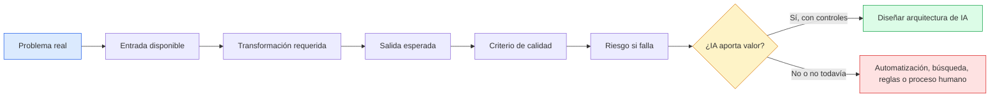
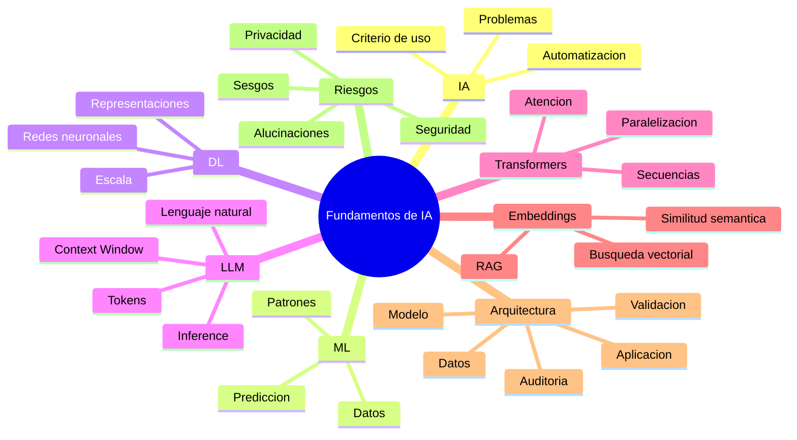
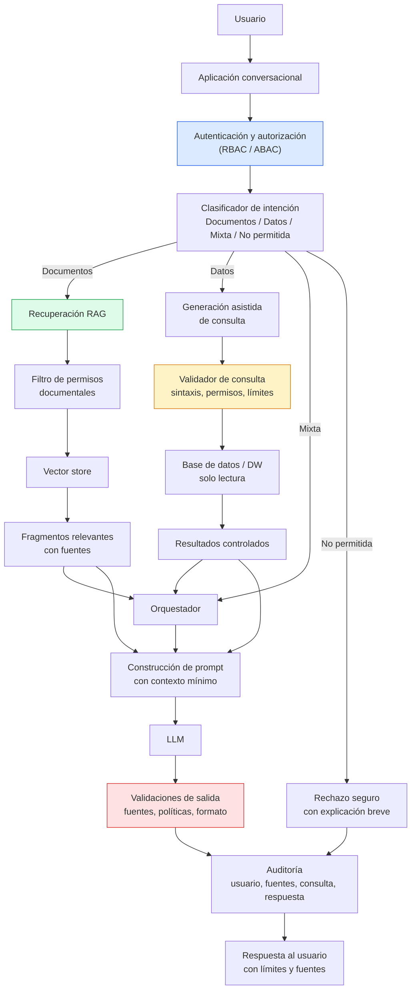
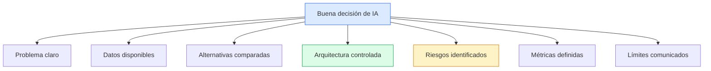

# Ingeniería de IA desde los Fundamentos

# Módulo I — Los Fundamentos de la Inteligencia Artificial

# Capítulo 15 — Evaluación Final del Módulo I: De los Fundamentos al Criterio Profesional

**Versión:** 0.5 (Revisión conceptual)

---

## 1. Objetivos de aprendizaje

Esta evaluación no busca medir memoria. Busca comprobar si podés usar los fundamentos del Módulo I para pensar como un profesional que diseña, evalúa y defiende soluciones de Inteligencia Artificial (IA).

Al finalizar este capítulo serás capaz de:

1. Explicar con tus propias palabras los conceptos centrales del Módulo I sin depender de definiciones memorizadas.
2. Diferenciar IA, Machine Learning (ML), Deep Learning (DL), Large Language Models (LLMs), embeddings, tokens, contexto y memoria.
3. Analizar requerimientos ambiguos y decidir si una solución de IA aporta valor real o si conviene una alternativa más simple.
4. Diseñar una arquitectura conceptual para consultas en lenguaje natural sobre información corporativa.
5. Identificar riesgos técnicos, operativos, éticos y de seguridad en soluciones con LLMs.
6. Justificar decisiones ante perfiles técnicos y no técnicos.
7. Reconocer tus brechas de conocimiento antes de avanzar al Módulo II.
8. Convertir una idea de IA en una propuesta evaluable, medible y responsable.

---

## 2. Introducción narrativa

Imaginá la escena.

Terminó una reunión de dirección. Alguien acaba de decir: "Tenemos que incorporar IA este trimestre". La frase queda flotando en la sala. El área comercial quiere un asistente para clientes. Operaciones quiere automatizar reportes. Recursos Humanos quiere consultar políticas internas en lenguaje natural. Seguridad pregunta qué datos se van a enviar al modelo. Finanzas pregunta cuánto cuesta. Legal pregunta quién responde si el sistema se equivoca.

Todas esas preguntas son legítimas.

En ese momento, el valor del profesional no está en saber recitar qué es un Transformer. Está en poder ordenar la conversación. Separar problemas reales de entusiasmo tecnológico. Distinguir automatización de IA. Identificar qué datos existen, qué riesgos aparecen, qué arquitectura sería razonable y qué promesas no deberían hacerse.

Ese es el propósito de esta evaluación.

El Módulo I construyó los fundamentos: qué es la IA, cómo se relaciona con ML y DL, por qué los LLMs cambiaron la forma de interactuar con modelos, cómo funcionan tokens y ventanas de contexto, qué son los embeddings, cómo se usa Retrieval-Augmented Generation (RAG) y por qué los sistemas de IA requieren controles. Este capítulo te pide usar todo eso junto.

No alcanza con responder "usaría un LLM". Un arquitecto debe poder explicar por qué, para quién, con qué datos, bajo qué límites, con qué controles y cómo se mediría el resultado.

---

## 3. Cómo usar esta evaluación

Esta evaluación está diseñada para tres usos distintos:

1. **Autoevaluación individual:** para detectar qué conceptos necesitás repasar antes de avanzar.
2. **Evaluación en un curso:** para que un docente o mentor observe comprensión conceptual y criterio profesional.
3. **Simulación de trabajo real:** para practicar el tipo de razonamiento que aparece en proyectos de IA dentro de organizaciones.

La recomendación es responder por escrito. No porque la escritura sea un formalismo, sino porque escribir obliga a ordenar el pensamiento. Una respuesta que parece clara en la mente suele mostrar sus huecos cuando se redacta.

### Tiempo estimado

- Evaluación conceptual: 60 a 90 minutos.
- Análisis de casos: 90 minutos.
- Diseño de arquitectura: 90 a 120 minutos.
- Laboratorio integrador: 2 a 4 horas.
- Reflexión final: 30 minutos.

### Material permitido

Podés consultar capítulos anteriores, notas personales y documentación técnica. En la práctica profesional nadie diseña arquitectura de memoria. Lo importante no es recordar todo, sino saber encontrar, interpretar y aplicar lo necesario.

### Criterio de corrección

Una buena respuesta:

- define el problema antes de proponer la solución;
- usa terminología técnica con precisión;
- reconoce supuestos y límites;
- compara alternativas;
- justifica decisiones;
- identifica riesgos;
- propone controles verificables;
- evita afirmaciones absolutas.

Una respuesta débil:

- propone IA sin explicar el problema;
- usa conceptos como etiquetas decorativas;
- promete exactitud sin validación;
- ignora seguridad, privacidad o costo;
- confunde contexto con memoria;
- asume que un modelo más grande siempre es mejor;
- trata al LLM como si "entendiera" en sentido humano.

---

## 4. Evaluar desde primeros principios

Antes de responder cualquier consigna, conviene volver a la pregunta fundamental:

**¿Qué problema estamos intentando resolver?**

La IA no es un fin. Es una familia de técnicas para construir sistemas que realizan tareas que, tradicionalmente, requerían capacidades asociadas con inteligencia humana: clasificar, predecir, generar lenguaje, reconocer patrones, resumir, planificar, recomendar o interactuar con información no estructurada.

Desde primeros principios, toda solución de IA puede analizarse con cinco preguntas:

1. **Entrada:** ¿qué información recibe el sistema?
2. **Transformación:** ¿qué debe hacer con esa información?
3. **Salida:** ¿qué resultado produce?
4. **Criterio de calidad:** ¿cómo sabemos si el resultado es bueno?
5. **Riesgo:** ¿qué pasa si el resultado es incorrecto?

Esta estructura evita dos errores frecuentes. El primero es enamorarse de una herramienta antes de entender el problema. El segundo es rechazar la IA por desconfianza general sin analizar si, en ese caso concreto, puede aportar valor.

### Analogía: el puente y el material

Diseñar una solución de IA se parece a diseñar un puente. Nadie empieza preguntando "¿usamos acero, hormigón o madera?" sin saber qué se quiere cruzar, qué carga soportará, qué clima enfrentará y qué ocurrirá si falla.

El LLM, el vector store, el modelo de embeddings o el pipeline de datos son materiales y componentes. La arquitectura empieza antes: con el problema, las restricciones y el riesgo aceptable.

---

## 5. Mapa conceptual del Módulo I

El Módulo I puede resumirse como una progresión: de conceptos generales a decisiones arquitectónicas.

Este mapa no reemplaza los capítulos. Sirve como guía para responder la evaluación. Si una consigna te resulta difícil, ubicá qué rama del mapa está involucrada y volvé al capítulo correspondiente.

---

## 6. Parte I — Preguntas conceptuales

Respondé con tus propias palabras. Se valora más una explicación breve y precisa que una respuesta extensa pero vaga.

### 6.1 Conceptos fundamentales

1. ¿Qué diferencia existe entre Inteligencia Artificial (IA), Machine Learning (ML) y Deep Learning (DL)?
2. ¿Qué problema intenta resolver ML que no resuelven bien las reglas programadas manualmente?
3. ¿Por qué DL fue especialmente importante para trabajar con datos no estructurados como imágenes, audio y lenguaje?
4. ¿Qué es un Large Language Model (LLM) y qué tipo de tarea realiza durante la inferencia?
5. ¿Por qué es incorrecto decir, sin aclaración, que "el modelo sabe" o "el modelo entiende"?

### 6.2 Lenguaje, tokens y contexto

6. ¿Por qué los modelos trabajan con tokens y no directamente con palabras?
7. ¿Qué es la Context Window y por qué limita lo que el modelo puede considerar en una respuesta?
8. ¿Qué diferencia existe entre contexto y memoria?
9. ¿Qué ocurre cuando enviamos demasiada información irrelevante al contexto?
10. ¿Por qué una respuesta más larga no necesariamente es una respuesta mejor?

### 6.3 Embeddings, búsqueda semántica y RAG

11. ¿Qué es un embedding?
12. ¿Qué significa que dos textos estén "cerca" en un espacio vectorial?
13. ¿Qué problema resuelve Retrieval-Augmented Generation (RAG)?
14. ¿Por qué RAG no elimina por completo el riesgo de respuestas incorrectas?
15. ¿Qué diferencia hay entre buscar documentos por palabras clave y buscarlos por similitud semántica?

### 6.4 Parámetros, comportamiento y riesgo

16. ¿Qué función cumple la temperatura en la generación de texto?
17. ¿Por qué un LLM puede producir una respuesta incorrecta con tono convincente?
18. ¿Qué tipo de tareas requieren mayor control y menor creatividad?
19. ¿Qué riesgos aparecen al conectar un LLM con herramientas externas?
20. ¿Qué mito sobre IA considerás más peligroso en el ámbito empresarial? Justificá.

### Rúbrica sugerida

| Nivel | Señales observables |
|---|---|
| Inicial | Define términos de forma superficial, con ejemplos escasos o imprecisos. |
| En desarrollo | Explica la mayoría de los conceptos, pero confunde límites o relaciones. |
| Competente | Relaciona conceptos, usa terminología correcta y reconoce limitaciones. |
| Avanzado | Explica desde el problema, compara alternativas y anticipa riesgos. |

---

## 7. Parte II — Análisis de afirmaciones

En esta parte no se busca responder "sí" o "no". Se busca razonar. Para cada afirmación, indicá:

- qué tiene de cierto;
- qué tiene de incompleto o riesgoso;
- qué preguntas harías antes de decidir;
- qué alternativa recomendarías.

### Caso A — "Necesitamos IA para enviar automáticamente correos"

Esta frase confunde automatización con IA. Enviar correos ante eventos conocidos puede resolverse con reglas, colas de mensajes, plantillas y sistemas transaccionales. La IA solo aportaría valor si el contenido requiere interpretación, personalización semántica, clasificación de intención, resumen de información variable o generación controlada de lenguaje.

Una respuesta sólida debería distinguir:

- envío automático por reglas;
- generación de contenido asistida por LLM;
- revisión humana antes del envío;
- riesgos de tono, privacidad y errores;
- métricas como tiempo ahorrado, tasa de respuesta y cantidad de correcciones humanas.

### Caso B — "El modelo más grande siempre es la mejor opción"

Un modelo más grande puede tener mayor capacidad general, pero también mayor costo, latencia, consumo energético y complejidad operativa. Para tareas simples, un modelo pequeño o una solución basada en reglas puede ser mejor.

Una respuesta sólida debería analizar:

- complejidad de la tarea;
- volumen de uso;
- presupuesto;
- latencia aceptable;
- privacidad;
- facilidad de evaluación;
- disponibilidad de modelos especializados.

### Caso C — "Vamos a enviar toda la documentación al modelo en cada consulta"

La frase ignora límites de Context Window, costo, ruido y seguridad. Más contexto no siempre implica mejor respuesta. Si se envía información irrelevante, el modelo puede distraerse, elevar costos y exponer datos innecesarios.

Una respuesta sólida debería proponer:

- segmentación documental;
- embeddings;
- búsqueda semántica;
- recuperación de fragmentos relevantes;
- control de permisos antes de recuperar contenido;
- citas de fuentes;
- auditoría de consultas.

### Caso D — "Si la respuesta parece convincente, podemos asumir que es correcta"

La fluidez del lenguaje no garantiza verdad. Un LLM optimiza la generación de una secuencia plausible según su entrenamiento y el contexto disponible. Puede producir errores, omitir matices o inventar detalles.

Una respuesta sólida debería incluir:

- validación contra fuentes;
- pruebas con casos conocidos;
- revisión humana en procesos críticos;
- límites explícitos de uso;
- trazabilidad de decisiones;
- métricas de precisión y tasa de error.

### Caso E — "Entrenemos un modelo propio para que conozca nuestros documentos"

Puede ser una opción válida en casos específicos, pero suele ser una respuesta costosa y prematura. Si el objetivo es consultar documentación cambiante, RAG suele ser más mantenible que entrenar o ajustar un modelo.

Una respuesta sólida debería comparar:

- RAG;
- Fine-tuning;
- buscador tradicional;
- modelo comercial;
- modelo local;
- costo de actualización;
- sensibilidad de los datos;
- capacidad del equipo.

---

## 8. Parte III — Diseño de arquitectura conceptual

### Escenario

Una empresa posee:

- documentación técnica;
- procedimientos internos;
- manuales operativos;
- tickets históricos;
- una base de datos corporativa;
- usuarios de distintas áreas con permisos diferentes.

Los usuarios desean realizar consultas mediante lenguaje natural. Algunas consultas piden información documental. Otras piden datos operativos. Algunas podrían mezclar ambas cosas.

Diseñá una arquitectura conceptual indicando:

- aplicación;
- autenticación y autorización;
- clasificación de intención;
- RAG para documentación;
- acceso controlado a base de datos;
- Large Language Model (LLM);
- validaciones;
- auditoría;
- respuesta al usuario;
- mecanismos de evaluación.

No es necesario especificar tecnologías concretas. Lo importante es justificar las decisiones.

### Arquitectura de referencia

### Decisiones que deberías justificar

**Separar documentos de datos estructurados.** No es lo mismo buscar políticas internas que ejecutar una consulta sobre un Data Warehouse. Cada flujo necesita controles distintos.

**Aplicar permisos antes de recuperar información.** El sistema no debería traer al contexto documentos que el usuario no está autorizado a ver.

**Usar contexto mínimo suficiente.** El prompt debe incluir información relevante, no todo lo disponible.

**Validar consultas antes de ejecutarlas.** Si se genera SQL o cualquier acción sobre sistemas externos, debe existir una capa de validación independiente del modelo.

**Auditar el proceso completo.** En un sistema empresarial importa saber quién preguntó, qué fuentes se usaron, qué respuesta se entregó y qué controles se aplicaron.

**Mostrar límites al usuario.** Una respuesta profesional puede decir "según las fuentes consultadas" o "no encontré evidencia suficiente". Eso es mejor que inventar certeza.

---

## 9. Parte IV — Caso profesional propio

Elegí un proyecto real o plausible de tu organización. Si no trabajás actualmente en una organización, usá un caso de una empresa ficticia pero concreta.

Respondé:

1. ¿Cuál es el problema operativo o de negocio?
2. ¿Quiénes son los usuarios?
3. ¿Qué decisión o tarea quieren mejorar?
4. ¿Qué información está disponible?
5. ¿La información es estructurada, no estructurada o mixta?
6. ¿Requiere realmente IA?
7. ¿Qué alternativa sin IA considerarías primero?
8. ¿Qué tipo de IA utilizarías si corresponde?
9. ¿Qué rol cumpliría el LLM?
10. ¿Qué rol cumplirían embeddings, RAG o búsqueda tradicional?
11. ¿Qué datos no deberían enviarse al modelo?
12. ¿Qué riesgos existen?
13. ¿Qué controles implementarías?
14. ¿Cómo medirías el éxito?
15. ¿Qué decisión recomendarías y bajo qué supuestos?

### Plantilla de respuesta

| Dimensión | Respuesta |
|---|---|
| Problema | |
| Usuarios | |
| Tarea actual | |
| Dolor principal | |
| Datos disponibles | |
| Alternativa sin IA | |
| Solución con IA propuesta | |
| Componentes principales | |
| Riesgos | |
| Controles | |
| Métricas de éxito | |
| Decisión recomendada | |

### Ejemplo breve

Una empresa de mantenimiento industrial recibe miles de tickets escritos por técnicos. El problema no es "usar IA", sino reducir el tiempo para encontrar soluciones ya aplicadas en incidentes similares.

Una solución razonable podría combinar embeddings sobre tickets históricos, búsqueda semántica, filtros por tipo de equipo y un LLM que sintetice posibles acciones citando tickets previos. No convendría permitir que el sistema cierre tickets automáticamente sin revisión humana, porque una recomendación incorrecta puede afectar seguridad operativa.

---

## 10. Conversación con un arquitecto

**Estudiante:** Creo que mi propuesta está bien. Voy a usar un LLM para responder preguntas sobre todos los documentos internos.

**Arquitecto:** ¿Cuál es el problema concreto?

**Estudiante:** Que la gente no encuentra información.

**Arquitecto:** Eso todavía es amplio. ¿No la encuentra porque los documentos no existen, porque están mal organizados, porque el buscador es malo o porque las personas no saben qué términos usar?

**Estudiante:** Principalmente porque no saben dónde buscar y los términos cambian entre áreas.

**Arquitecto:** Entonces la búsqueda semántica puede aportar valor. ¿Todos los usuarios pueden ver todos los documentos?

**Estudiante:** No. Hay documentos de finanzas, legales y de recursos humanos.

**Arquitecto:** Entonces el control de permisos no puede quedar después de la respuesta. Tiene que estar antes de recuperar contexto.

**Estudiante:** Podría filtrar documentos por permisos antes de consultar el vector store.

**Arquitecto:** Correcto. ¿Cómo sabrá el usuario si la respuesta es confiable?

**Estudiante:** La respuesta debería citar las fuentes utilizadas.

**Arquitecto:** Bien. ¿Y qué pasa si no hay fuentes suficientes?

**Estudiante:** El sistema debería decir que no tiene evidencia suficiente, no inventar.

**Arquitecto:** Ahí aparece criterio. No estás diseñando un chatbot. Estás diseñando un sistema de acceso controlado a conocimiento corporativo con asistencia de lenguaje natural.

**Estudiante:** Entonces la arquitectura importa más que el prompt.

**Arquitecto:** Exactamente. El prompt ayuda. La arquitectura decide si el sistema puede operar responsablemente.

---

## 11. Errores frecuentes

### 11.1 Confundir IA con automatización

No todo flujo automático requiere IA. Si el problema puede resolverse con reglas determinísticas simples, esa suele ser la primera alternativa a considerar.

### 11.2 Empezar por el modelo

Elegir un modelo antes de entender el problema lleva a diseños caros y frágiles. El orden correcto es problema, datos, restricciones, arquitectura y recién después modelo.

### 11.3 Tratar el contexto como memoria permanente

La Context Window es información disponible para una inferencia específica. No equivale a memoria persistente ni a aprendizaje del modelo.

### 11.4 Creer que RAG garantiza verdad

RAG mejora el acceso a información relevante, pero no garantiza que la respuesta final sea correcta. La recuperación puede fallar, los fragmentos pueden ser ambiguos y el modelo puede sintetizar mal.

### 11.5 Ignorar permisos

Si el sistema recupera documentos no autorizados y luego intenta ocultarlos en la respuesta, el control llega tarde. La autorización debe aplicarse antes de la recuperación.

### 11.6 No medir calidad

Sin métricas, una solución de IA queda reducida a impresiones subjetivas. Deben definirse métricas de precisión, utilidad, tiempo ahorrado, tasa de escalamiento, costo y errores.

### 11.7 Confundir tono con confiabilidad

Una respuesta clara, educada y segura puede estar equivocada. La validación debe basarse en evidencia, no en estilo.

### 11.8 Sobrecomplicar la primera versión

Un primer piloto no necesita resolver todos los casos. Necesita probar una hipótesis de valor con alcance controlado y riesgos gestionados.

---

## 12. Buenas prácticas

1. Definí el problema en una frase verificable.
2. Identificá usuarios, tareas y decisiones antes de elegir tecnología.
3. Compará siempre una alternativa sin IA.
4. Usá el modelo más simple que cumpla el objetivo.
5. Separá generación de texto, recuperación de información y ejecución de acciones.
6. Aplicá controles de permisos antes de recuperar o enviar contexto.
7. Limitá el contexto a información relevante y autorizada.
8. Pedí al sistema que cite fuentes cuando responda sobre documentación.
9. Validá salidas críticas con reglas, pruebas o revisión humana.
10. Registrá consultas, fuentes, respuestas y errores para auditoría.
11. Diseñá métricas desde el inicio.
12. Documentá supuestos y límites de la solución.

---

## 13. Laboratorio integrador

### Objetivo

Diseñar y evaluar una propuesta conceptual de solución de IA para un problema real, aplicando los fundamentos del Módulo I.

### Nivel

Intermedio.

### Tiempo estimado

2 a 4 horas.

### Prerrequisitos

Haber completado los capítulos del Módulo I, especialmente los contenidos sobre LLMs, tokens, Context Window, embeddings, RAG, arquitectura y riesgos.

### Herramientas

- Un editor de texto.
- Una hoja de cálculo o tabla Markdown.
- Opcional: ChatGPT, Claude, Gemini o un modelo local para contrastar respuestas.
- Opcional: una herramienta de diagramas compatible con Mermaid.

### Escenario

Tu organización quiere crear un asistente interno para responder consultas sobre documentación, procedimientos y datos operativos. El patrocinador del proyecto pide una propuesta inicial para decidir si vale la pena avanzar a un piloto.

### Desarrollo

**Paso 1 — Definir el problema**

Acción: redactá el problema en una frase.

Motivo: si el problema no puede expresarse con claridad, la arquitectura será una acumulación de componentes sin dirección.

Resultado esperado: una frase como "Reducir el tiempo que el equipo de soporte tarda en encontrar procedimientos vigentes para resolver incidentes internos".

**Paso 2 — Identificar usuarios y tareas**

Acción: listá tres perfiles de usuario y las tareas que realizarían.

Motivo: distintos usuarios implican distintos permisos, interfaces y riesgos.

Resultado esperado: una tabla con usuario, tarea, información requerida y riesgo principal.

**Paso 3 — Clasificar la información**

Acción: separá información estructurada, no estructurada y sensible.

Motivo: cada tipo de información requiere una estrategia diferente de acceso y control.

Resultado esperado: un inventario simple de fuentes.

**Paso 4 — Comparar alternativas**

Acción: compará al menos tres opciones: automatización sin IA, buscador tradicional y sistema con RAG + LLM.

Motivo: una recomendación profesional necesita alternativas, no solo una solución preferida.

Resultado esperado: una tabla de ventajas, desventajas, costo relativo y riesgo.

**Paso 5 — Diseñar la arquitectura conceptual**

Acción: dibujá un diagrama Mermaid o describí los componentes principales.

Motivo: el diagrama obliga a explicitar flujos, límites y responsabilidades.

Resultado esperado: una arquitectura con aplicación, autenticación, recuperación, modelo, validación, auditoría y respuesta.

**Paso 6 — Definir controles**

Acción: asociá cada riesgo con un control.

Motivo: identificar riesgos sin controles no mejora la solución.

Resultado esperado: una matriz de riesgo y mitigación.

**Paso 7 — Definir métricas**

Acción: elegí cinco métricas de éxito.

Motivo: sin métricas no hay forma objetiva de evaluar el piloto.

Resultado esperado: métricas como tiempo promedio de búsqueda, precisión de fuentes, satisfacción del usuario, tasa de escalamiento y costo por consulta.

**Paso 8 — Redactar recomendación ejecutiva**

Acción: escribí una recomendación de 200 a 300 palabras para un comité técnico.

Motivo: un arquitecto debe comunicar decisiones, no solo diseñarlas.

Resultado esperado: una recomendación que indique si conviene avanzar, con qué alcance y bajo qué condiciones.

### Validación

El laboratorio se considera satisfactorio si:

- el problema está definido sin mencionar primero una herramienta;
- existen alternativas comparadas;
- la arquitectura incluye controles antes y después del modelo;
- los riesgos están conectados con mitigaciones;
- las métricas permiten evaluar resultados;
- la recomendación final es defendible.

### Reflexión

1. ¿Qué parte de la propuesta fue más difícil: definir el problema, diseñar la arquitectura o justificar los controles?
2. ¿Qué supuestos podrían invalidar tu recomendación?
3. ¿Qué componente eliminarías para construir un piloto mínimo?
4. ¿Qué riesgo impediría pasar a producción?

### Desafíos opcionales

1. Agregá un flujo para consultas sobre datos estructurados con validación de SQL.
2. Definí una política de retención de logs y auditoría.
3. Diseñá una rúbrica para evaluar respuestas del asistente.
4. Compará cómo dos LLMs distintos responden a la misma consulta del escenario.

---

## 14. Preguntas de reflexión

1. ¿Qué concepto del Módulo I cambió más tu forma de pensar sobre la IA?
2. ¿En qué situaciones conviene evitar IA aunque técnicamente sea posible usarla?
3. ¿Qué diferencia hay entre una demostración atractiva y una solución lista para producción?
4. ¿Qué riesgos suelen subestimarse en proyectos con LLMs?
5. ¿Cómo explicarías a un directivo que "más grande" no siempre significa "mejor"?
6. ¿Qué controles mínimos exigirías antes de conectar un LLM con una base de datos?
7. ¿Qué señales te indicarían que un sistema RAG está recuperando mal la información?
8. ¿Qué parte del Módulo I necesitás repasar antes de avanzar?
9. ¿Qué hábitos profesionales deberías desarrollar para diseñar mejores sistemas de IA?
10. ¿Qué responsabilidad tiene el arquitecto cuando una solución de IA puede afectar decisiones reales?

---

## 15. Autoevaluación

Asignate una puntuación de 1 a 5 en cada competencia.

| Competencia | 1 | 2 | 3 | 4 | 5 | Evidencia breve |
|---|---:|---:|---:|---:|---:|---|
| Comprensión de IA, ML y DL | | | | | | |
| Comprensión de LLMs | | | | | | |
| Tokens y Context Window | | | | | | |
| Contexto vs memoria | | | | | | |
| Embeddings y similitud semántica | | | | | | |
| RAG | | | | | | |
| Parámetros de generación | | | | | | |
| Riesgos y alucinaciones | | | | | | |
| Diseño de arquitectura conceptual | | | | | | |
| Justificación de decisiones | | | | | | |
| Comunicación profesional | | | | | | |

### Interpretación

- **1 o 2:** conviene repasar antes de avanzar.
- **3:** comprensión suficiente, pero todavía dependiente de ejemplos guiados.
- **4:** capacidad de aplicar conceptos en escenarios nuevos.
- **5:** capacidad de explicar, justificar y enseñar el concepto a otros.

Los puntajes bajos no son un fracaso. Son un mapa de estudio.

---

## 16. Resumen

Este capítulo cerró el Módulo I convirtiendo los fundamentos en evaluación práctica.

La idea central es simple: aprender IA no consiste en acumular nombres de técnicas. Consiste en desarrollar criterio para decidir cuándo usar IA, cuándo no usarla, qué arquitectura diseñar, qué riesgos controlar y cómo medir si la solución funciona.

Un profesional preparado no responde automáticamente "usemos un LLM". Primero entiende el problema. Luego analiza datos, usuarios, restricciones, alternativas, costos y riesgos. Solo después diseña una solución.

El Módulo I construyó esa base. El Módulo II tomará una parte específica de ese trabajo: cómo comunicarse con modelos mediante prompts profesionales, reutilizables y evaluables.

---

## 17. Checklist final del Módulo I

Antes de avanzar al Módulo II, verificá si podés:

- [ ] Explicar qué problema resuelve la IA en términos generales.
- [ ] Diferenciar IA, ML y DL sin usar definiciones memorizadas.
- [ ] Explicar qué es un LLM y qué hace durante la inferencia.
- [ ] Describir por qué existen los tokens.
- [ ] Explicar qué es la Context Window.
- [ ] Diferenciar contexto de memoria.
- [ ] Explicar qué es un embedding.
- [ ] Describir cómo funciona conceptualmente RAG.
- [ ] Identificar cuándo un buscador tradicional puede ser suficiente.
- [ ] Reconocer riesgos de alucinaciones y respuestas incorrectas.
- [ ] Diseñar una arquitectura conceptual con controles.
- [ ] Justificar una decisión de IA frente a alternativas.
- [ ] Definir métricas de éxito para un piloto.
- [ ] Comunicar límites y supuestos de una solución.

Si marcaste menos de diez elementos, conviene repasar antes de continuar.

---

## 18. Glosario breve

**Agente:** aplicación que combina un modelo con herramientas, memoria y capacidad de ejecutar acciones.

**Context Window:** cantidad máxima de tokens que el modelo puede considerar en una inferencia.

**Deep Learning (DL):** rama de Machine Learning basada en redes neuronales profundas.

**Embedding:** representación vectorial de datos que permite comparar similitud semántica.

**Fine-tuning:** ajuste de un modelo existente con datos adicionales para modificar o especializar su comportamiento.

**Inference:** proceso en el que un modelo genera una salida a partir de una entrada.

**Inteligencia Artificial (IA):** campo orientado a construir sistemas capaces de realizar tareas asociadas con inteligencia humana.

**Large Language Model (LLM):** modelo entrenado para procesar y generar lenguaje natural a gran escala.

**Machine Learning (ML):** enfoque en el que un sistema aprende patrones desde datos en lugar de depender solo de reglas explícitas.

**Prompt:** entrada textual o multimodal que guía la respuesta de un modelo.

**Retrieval-Augmented Generation (RAG):** arquitectura que combina recuperación de información externa con generación de respuestas mediante un modelo.

**Token:** unidad de tokenización utilizada por el modelo para procesar texto.

---

## 19. Bibliografía y lecturas recomendadas

- Vaswani, A. et al. "Attention Is All You Need". 2017.
- Jurafsky, D. y Martin, J. H. *Speech and Language Processing*. Borrador disponible en línea.
- Goodfellow, I., Bengio, Y. y Courville, A. *Deep Learning*. MIT Press.
- Documentación técnica de proveedores de LLMs sobre tokens, contexto, embeddings y evaluación.
- Guías de arquitectura y seguridad para sistemas con IA generativa publicadas por organismos y proveedores especializados.

---

## 20. Próximos pasos

**Módulo II — Prompt Engineering Profesional**

En el próximo módulo vamos a trabajar sobre una habilidad concreta: diseñar prompts útiles, robustos y evaluables. No como trucos aislados, sino como parte de una práctica profesional.

Aprenderás a:

- formular instrucciones claras;
- controlar formato, tono y alcance;
- diseñar prompts reutilizables;
- evaluar respuestas;
- reducir ambigüedad;
- integrar prompts dentro de aplicaciones;
- reconocer cuándo el problema no se resuelve con mejor prompt, sino con mejor arquitectura.

La transición es importante: el prompt no reemplaza los fundamentos. Se apoya en ellos.

> Un arquitecto no memoriza respuestas. Comprende problemas para poder diseñar soluciones.
